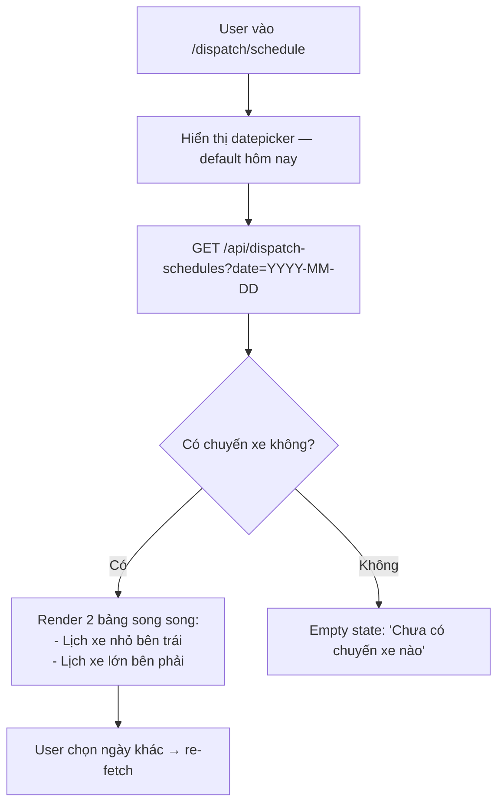
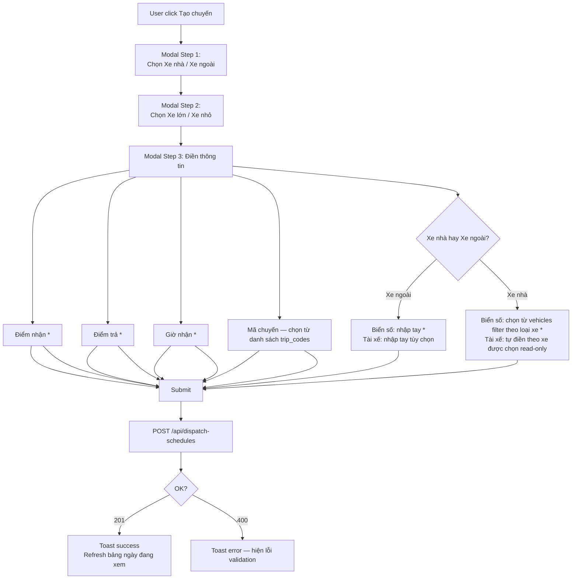

# BA Analysis — Bảng điều phối xe

**Ngày:** 2026-04-07
**Feature:** Bảng điều phối xe (thuộc nhóm "Điều hành vận tải")
**Route:** `/dispatch/schedule`

---

## 1.1 Flowchart TO-BE

### Luồng xem bảng điều phối



### Luồng tạo chuyến xe



---

## 1.2 Business Rules

```
BR-001: Lưu value không lưu ID
  - bien_so, ma_chuyen, tai_xe lưu text value (KHÔNG lưu FK ID)
  - Lý do: dữ liệu theo ngày — masterdata có thể thay đổi (soft-update)
    lịch sử chuyến xe cũ phải giữ nguyên value cũ

BR-002: Loại xe phân loại bảng
  - loai_xe = 'Xe nhỏ' → hiển thị ở "Lịch xe nhỏ"
  - loai_xe = 'Xe lớn' → hiển thị ở "Lịch xe lớn"

BR-003: Biển số — phụ thuộc xe_type
  - xe_type = 'Xe nhà' → chọn từ danh sách vehicles (active, filter theo loai_xe)
    → sau khi chọn, tài xế tự động điền từ vehicle.tai_xe[0] (hoặc rỗng nếu không có)
  - xe_type = 'Xe ngoài' → nhập tay, không giới hạn
    → tài xế nhập tay, tùy chọn (không bắt buộc)

BR-004: Mã chuyến — chọn từ danh sách trip_codes active
  - Lưu giá trị trip_codes.ma (text), không lưu trip_codes.id
  - Tùy chọn (không bắt buộc)

BR-005: Ngày hiển thị
  - Default = ngày hôm nay (client timezone)
  - User có thể chọn ngày bất kỳ để xem lịch

BR-006: Không có soft-delete cho dispatch_schedules
  - Chuyến đã tạo có thể xóa (hard delete) hoặc sửa (update in-place)
  - Không cần lịch sử thay đổi (audit trail không yêu cầu)

BR-007: Sắp xếp trong bảng
  - Sort theo gio_nhan ASC trong mỗi bảng (xe nhỏ / xe lớn)

BR-008: Không có phân trang
  - Mỗi ngày thường có < 50 chuyến, không cần pagination
```

---

## 1.3 Data Model

```sql
-- Table mới: dispatch_schedules
CREATE TABLE dispatch_schedules (
  id           SERIAL PRIMARY KEY,
  ngay         DATE NOT NULL,
  loai_xe      VARCHAR(10) NOT NULL CHECK (loai_xe IN ('Xe lớn', 'Xe nhỏ')),
  xe_type      VARCHAR(10) NOT NULL CHECK (xe_type IN ('Xe nhà', 'Xe ngoài')),

  -- Stored values (NOT FK) — lưu giá trị tại thời điểm tạo
  bien_so      VARCHAR(50) NOT NULL,
  tai_xe       TEXT,                  -- có thể rỗng nếu xe ngoài không biết tài xế
  ma_chuyen    VARCHAR(100),          -- tùy chọn

  -- Trip info
  diem_nhan    TEXT NOT NULL,
  tan          TEXT,                  -- tấn (optional)
  can          TEXT,                  -- CAN (optional)
  gio_nhan     TIME NOT NULL,
  ghi_chu      TEXT,

  -- Optional convenience references (nullable, non-blocking)
  vehicle_id   INTEGER REFERENCES vehicles(id) ON DELETE SET NULL,
  trip_code_id INTEGER REFERENCES trip_codes(id) ON DELETE SET NULL,

  -- Audit
  created_by   INTEGER REFERENCES users(id) ON DELETE SET NULL,
  created_at   TIMESTAMP WITH TIME ZONE DEFAULT NOW(),
  updated_at   TIMESTAMP WITH TIME ZONE DEFAULT NOW()
);

CREATE INDEX idx_dispatch_schedules_ngay ON dispatch_schedules(ngay);
CREATE INDEX idx_dispatch_schedules_ngay_loai ON dispatch_schedules(ngay, loai_xe);
```

**Ghi chú quan trọng:**
- `bien_so`, `tai_xe`, `ma_chuyen` là **text values** được snapshot tại thời điểm tạo
- `vehicle_id` và `trip_code_id` là **convenience references** — nullable, chỉ dùng để trace back nếu cần, KHÔNG dùng để join khi hiển thị
- `vehicles` và `trip_codes` dùng soft-update (deactivate old → insert new) nên FK có thể trỏ vào row đã deactive — điều này là chấp nhận được vì value đã được snapshot

---

## 1.4 API Contract

### GET /api/dispatch-schedules
```
Query params: date=YYYY-MM-DD (required)
Response: {
  success: true,
  data: {
    xe_nho: DispatchSchedule[],   -- loai_xe = 'Xe nhỏ', sorted by gio_nhan ASC
    xe_lon: DispatchSchedule[]    -- loai_xe = 'Xe lớn', sorted by gio_nhan ASC
  }
}

DispatchSchedule: {
  id: number,
  ngay: string,          -- YYYY-MM-DD
  loai_tuyen: string,    -- 'Tuyến cố định' | 'Tuyến ngoài'
  loai_xe: string,
  xe_type: string,
  diem_nhan: string,
  tan: string | null,
  can: string | null,
  gio_nhan: string,      -- HH:MM
  ghi_chu: string | null,
  created_at: string
}
```

### POST /api/dispatch-schedules
```
Request: {
  ngay: string,          -- YYYY-MM-DD (required)
  loai_tuyen: string,    -- 'Tuyến cố định' | 'Tuyến ngoài' (required)
  loai_xe: string,       -- 'Xe lớn' | 'Xe nhỏ' (required)
  xe_type: string,       -- 'Xe nhà' | 'Xe ngoài' (required)
  diem_nhan: string,     -- (required)
  tan?: string,          -- (optional)
  can?: string,          -- (optional)
  gio_nhan: string,      -- HH:MM (required)
  ghi_chu?: string,
}
Response: { success: true, data: DispatchSchedule }
```

### PUT /api/dispatch-schedules/:id
```
Request: Partial của POST body (tất cả fields đều optional)
Response: { success: true, data: DispatchSchedule }
```

### DELETE /api/dispatch-schedules/:id
```
Response: { success: true, message: 'Đã xóa chuyến xe' }
```

---

## 1.5 UI Screens cần thiết

```
Screen 1: Bảng điều phối xe
  → frontend/src/pages/dispatch/SchedulePage.tsx
  Layout: date picker + nút "Tạo chuyến" ở header
  Body: 2 bảng ngang hàng (Xe nhỏ | Xe lớn)

Modal 1: Tạo chuyến xe — Step 1
  → frontend/src/components/dispatch/CreateScheduleModal.tsx
  Chọn Xe nhà / Xe ngoài

Modal 1: Tạo chuyến xe — Step 2
  Chọn Xe lớn / Xe nhỏ

Modal 1: Tạo chuyến xe — Step 3
  Form điền thông tin: diem_nhan, diem_tra, gio_nhan,
  ma_chuyen (select), bien_so (select hoặc input), tai_xe (read-only hoặc input), ghi_chu

Modal 2: Xác nhận xóa chuyến
  → Confirm dialog inline (AlertDialog)
```

---

## 1.6 Edge Cases

```
EC-001: Xe nhà chọn nhưng vehicle có nhiều tài xế (tai_xe là JSON array)
  → Hiển thị tài xế đầu tiên trong array (index 0)
  → Nếu array rỗng → tài xế rỗng, cho phép nhập tay

EC-002: Trip codes không active
  → Chỉ hiển thị trip_codes có status = 'active'

EC-003: Ngày được chọn không có chuyến
  → Hiển thị empty state "Chưa có chuyến xe nào cho ngày này"

EC-004: Xe nhà nhưng không có xe nào active theo loại đã chọn
  → Hiển thị empty state trong dropdown "Không có xe nào"

EC-005: Xóa chuyến đã tạo
  → Hard delete — xác nhận trước khi xóa
  → Toast success sau khi xóa

EC-006: Sửa chuyến đã tạo
  → Trong scope v1: không implement edit (chỉ delete + tạo lại)
  → UI chỉ có nút Delete trên mỗi row

EC-007: gio_nhan format
  → Lưu dạng TIME trong DB
  → Hiển thị HH:MM
  → Input dạng time picker hoặc text HH:MM

EC-008: Ngày trong datepicker
  → Không giới hạn past/future — user có thể xem và tạo chuyến cho bất kỳ ngày nào
```

---

## 1.7 Nhóm tính năng mới trong Sidebar

Thêm nhóm mới "Điều hành vận tải" vào sidebar, song song với "Quản lý dữ liệu xe":

```
Sidebar:
├── Dashboard
├── Điều hành vận tải         ← MỚI (collapsible group)
│   └── Bảng điều phối xe    ← /dispatch/schedule
├── Quản lý dữ liệu xe
│   ├── Mã chuyến
│   └── Dữ liệu xe
└── Thiết lập người dùng
    ├── Quản lý người dùng
    ├── Quản lý vai trò
    └── Quản lý quyền
```

**Access:** Tất cả authenticated users (không cần permission đặc biệt trong v1).
