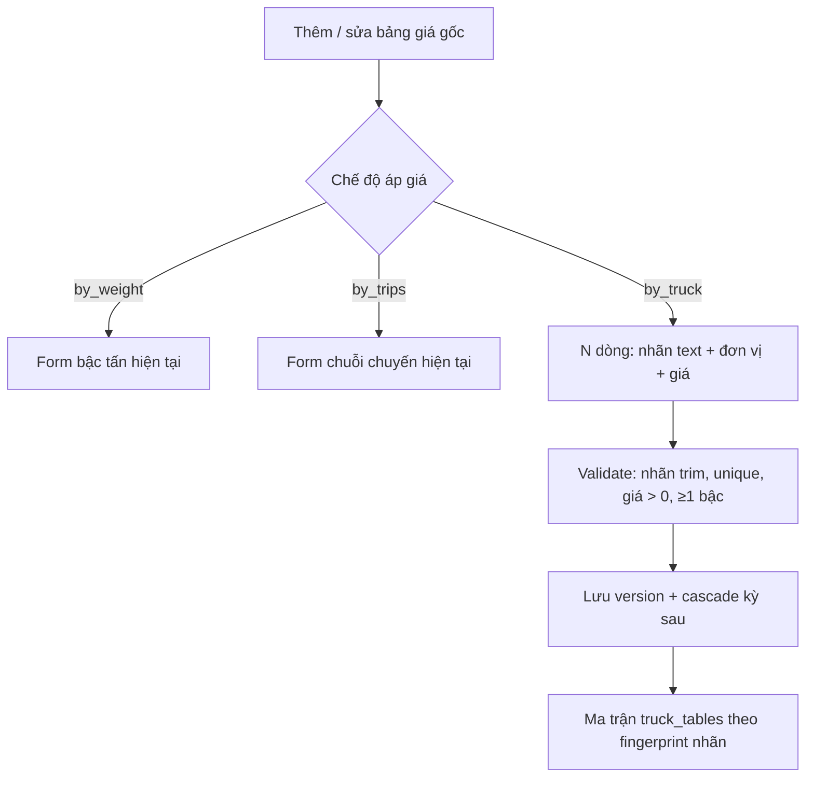

# BA Analysis: Chế độ tính giá theo loại Truck

**Ngày:** 2026-09-12  
**Feature:** Route pricing — pricing mode `by_truck`  
**Module:** Giá theo tuyến (`route_pricing`)  
**Scope:** FULL  
**Phụ thuộc:** Bảng giá (`price_books`), kỳ điều chỉnh, nhóm tuyến, ma trận, cascade % (đã có)  
**Feature gốc:** `docs/ba/20260711_route-pricing-analysis.md`  
**UI Spec:** `docs/ui/20260912_route-pricing-by-truck-ui-spec.md`  
**Nguồn:** Grill 2026-09-12 (shared understanding đã confirm)

---

## 1. Mô tả yêu cầu

Người dùng cần **chế độ áp giá thứ ba** trên bảng giá gốc của nhóm tuyến: **theo loại Truck** (tải định mức / class xe), không theo trọng lượng hàng (`by_weight`) và không theo số chuyến/xe/ngày (`by_trips`).

Mỗi version tự khai bậc bằng **chuỗi nhãn** copy từ Excel. Máy **không** parse bất đẳng thức, **không** lưu `from`/`to`/inclusive. Hai họ nhãn (và trộn) đều hợp lệ trên **cùng một version**, ví dụ:

- Class rời: `Truck 0,5mt` · `Truck 1,25mt` · `Truck 1,5mt` · `Truck 2,5mt` · `Truck 15mt`
- Khoảng: `Truck ≤2.5` · `Truck <9` · `Truck ≥15` · `8 < Truck ≤16` · `16 < Truck ≤23` · `Truck >23`

Danh sách trên là **minh họa**; không hardcode, không bắt buộc đủ bậc.

Phase này **không** lookup theo số `truck_mt`. Identity bậc = text đã trim.

---

## 1.1 Phạm vi

**Trong scope**
- `pricing_mode = 'by_truck'`
- Cột `label` trên `route_price_tiers`
- Validate nhãn / đơn vị / giá; cascade %; sửa giá gốc
- Modal thêm/sửa bảng giá gốc: radio thứ 3 + form bậc text
- Card lịch sử version: badge + cột nhãn Truck
- Ma trận: `truck_tables[]` (cùng pattern `weight_tables`, **không** nhét vào `weight_tables`)

**Ngoài scope**
- Seed Excel sheet F
- Delivery Import
- Lookup sống (`GET /lookup` vẫn `LOOKUP_DEFERRED`); không thêm `truck_mt` trên API lookup
- Catalog xe / đăng kiểm / map tải xe → nhãn
- Parse nhãn thành khoảng số; check overlap/gap giữa các bậc Truck
- Chuẩn hóa `≤`/`<=`, `2,5`/`2.5`
- Permission / role mới
- Đổi luật `by_weight` `(from, to]` hoặc chuỗi `by_trips`

---

## 1.2 Giả định (đã chốt grill)

| # | Quyết định |
|---|------------|
| A1 | Ý nghĩa nghiệp vụ: bậc mô tả **loại xe**, không phải tấn hàng. Lookup sau (CR khác) mới khớp số tải — phase này không implement matching. |
| A2 | Một version **một** mode: `by_weight` XOR `by_trips` XOR `by_truck`. |
| A3 | Trộn class rời và khoảng trên cùng version = nhiều dòng text khác nhau. |
| A4 | Scope dữ liệu theo `price_book_id`. |
| A5 | Pallet: 1 giá/version, cho phép 0, cột cuối mỗi bảng ma trận truck (giống weight). |
| A6 | Đơn vị từng bậc `chuyen` \| `tan`, **được trộn** trên một version. `by_truck` **không** dùng `min_billable_ton`. |
| A7 | Công thức tiền (tài liệu cho CR lookup sau): Pallet → `pallet_trip_price`; chuyến → `price`; tấn → `tấn_hàng × price` (không min). |
| A8 | Nhãn: trim hai đầu; so trùng **nguyên chuỗi**; rỗng sau trim → lỗi. |
| A9 | Fingerprint ma trận = **thứ tự form** `(label, pricing_unit)`. Không gộp tập con (khác weight). Khác chính tả / khác đơn vị / khác thứ tự → bảng khác. |
| A10 | Template UI: 1 dòng trống, thêm/xóa; không preset class. |

---

## 1.3 Flowchart TO-BE (delta)



---

## 2. Actors & Permissions

| Actor | Permission | Hành vi |
|-------|------------|---------|
| Kế toán / Admin | `route_pricing.manage` | Tạo/sửa giá gốc mode Truck, cascade |
| Viewer | `route_pricing.view` | Xem ma trận + lịch sử version Truck |

Không thêm permission code.

---

## 3. Business Rules

Giữ nguyên BR kỳ / nhóm / Pallet / cascade % / làm tròn nghìn của weight/trips. Delta:

```
BR-TRK-001: pricing_mode ∈ {by_weight, by_trips, by_truck}. CHECK DB cập nhật.
            Parse API giá trị khác → 400 INVALID_TIERS.

BR-TRK-002: Mode by_truck chọn bậc theo nhãn loại xe (text). Không dùng
            range_from/range_to để khớp hoặc chia khoảng xe.

BR-TRK-003: Mỗi bậc by_truck bắt buộc:
            - label: string, trim; sau trim length ≥ 1 và ≤ 255
            - pricing_unit ∈ {chuyen, tan}
            - price > 0
            - min_billable_ton phải null / 0 / omit (không lưu min)
            Hai bậc cùng version có label trim trùng nhau → 400 INVALID_TIERS
            (so nguyên chuỗi; phân biệt hoa thường; ≤ ≠ <=).
            ≥ 1 bậc.

BR-TRK-004: Không validate overlap/gap giữa các nhãn. Không parse toán tử.

BR-TRK-005: range_from / range_to trên hàng by_truck là placeholder kỹ thuật
            (range_from = 0, range_to = NULL) để thỏa NOT NULL + chk_rpt_range_order.
            Client by_truck không bắt buộc gửi range; BE tự set khi insert.
            by_weight / by_trips: label = NULL; không đổi validate khoảng hiện tại.

BR-TRK-006: sort_order = thứ tự dòng form (0..n-1). Cascade và ma trận giữ đúng thứ tự này.
            Không sort alphabet nhãn khi lưu.

BR-TRK-007: Tiền (khi lookup sau này; không implement phase này):
            Pallet → pallet_trip_price
            chuyen → price
            tan → weight_mt × price  (không max với min_billable)

BR-TRK-008: Không hardcode danh sách class / ngưỡng.

BR-TRK-009: Cascade % / sửa giá gốc: copy nguyên label + pricing_unit + sort_order;
            chỉ scale price (và pallet) làm tròn nghìn như hiện tại.
            Placeholder range giữ 0 / NULL.

BR-TRK-010: Ma trận — chỉ nhóm có version gốc by_truck:
            fingerprint schema_key = join sort_order của
              `t:{label}:{pricing_unit}`  (label đã trim, không encode thêm)
            Hai nhóm cùng schema_key → một bảng.
            Không merge subset (khác weight_tables).
            columns = bậc theo sort_order, kind: 'truck' | 'pallet'; Pallet luôn cuối mỗi block kỳ.
            column.key = schema token bậc (cùng `t:{label}:{unit}`).
            column.label = đúng text đã lưu; unit_label = vnđ/chuyến | vnđ/tấn.
            Response: truck_tables[] cùng shape weight_tables (rows/cells giống).
            Thứ tự section: weight_tables → truck_tables → trips.
            Sort truck_tables: số nhóm DESC, rồi schema_key ASC.
            Nhóm chưa có giá không vào truck_tables.
            Không trộn hàng by_truck vào weight_tables / trips.

BR-TRK-011: Đổi chế độ trong form chưa lưu = confirm + xóa bậc + nạp form mode mới
            (weight = template 5 bậc hiện có; trips = template chuyến; truck = 1 dòng trống).

BR-TRK-012: Lookup HTTP không đổi trong CR này (vẫn LOOKUP_DEFERRED).
```

---

## 4. Use Cases

### UC-1: Tạo giá gốc theo loại xe (nhãn tự do)
**Actor:** `route_pricing.manage`  
**Acceptance:**
- [ ] Chọn chế độ Theo loại xe; form 1 dòng: nhãn rỗng, đơn vị Chuyến, giá trống/0
- [ ] User nhập ví dụ `Truck 0,5mt` (chuyến) và thêm dòng `8 < Truck ≤16` (tấn); lưu được
- [ ] `pricing_mode=by_truck`, mỗi bậc có `label` đúng text, `pricing_unit` đúng, `min_billable_ton` null
- [ ] Cascade kỳ sau giữ nguyên nhãn + đơn vị + thứ tự; giá × (1+%) làm tròn nghìn
- [ ] Hai dòng cùng `Truck 0,5mt` (sau trim) → toast INVALID_TIERS, form giữ data
- [ ] Nhãn chỉ khoảng trắng → không lưu

### UC-2: Không chuẩn hóa chính tả
**Acceptance:**
- [ ] `Truck ≤2,5` và `Truck <=2.5` trên cùng version là **hai** bậc, lưu được
- [ ] Hai nhóm chỉ khác `0,5` vs `0.5` → **hai** bảng ma trận

### UC-3: Xem ma trận
**Acceptance:**
- [ ] Section “Theo loại xe” giữa “Theo trọng lượng” và “Theo chuyến / xe / ngày”
- [ ] Header cột = nhãn user; hàng đơn vị = vnđ/chuyến hoặc vnđ/tấn; Pallet cuối mỗi kỳ
- [ ] Cùng schema (cùng thứ tự nhãn+đơn vị) chung một bảng
- [ ] Nhóm chưa có giá không xuất hiện
- [ ] Không có nhóm by_truck → không render section

### UC-4: Sửa giá gốc Truck
**Acceptance:**
- [ ] Modal prefill nhãn, đơn vị, giá, Pallet
- [ ] Đổi nhãn / thêm / xóa bậc (≥1) rồi lưu → cascade lại kỳ sau
- [ ] Đổi radio sang weight/trips → confirm, mất dòng Truck

### UC-5: Không phá mode cũ
**Acceptance:**
- [ ] Tạo/sửa by_weight, by_trips, seed F hiện có, cascade, tests mode cũ pass
- [ ] `weight_tables` / `trips` contract field cũ không đổi
- [ ] Hàng weight/trips `label` null

---

## 5. Data Model (delta)

```sql
-- route_price_versions.pricing_mode
-- DROP CHECK cũ, thêm:
CHECK (pricing_mode IN ('by_weight', 'by_trips', 'by_truck'))

ALTER TABLE route_price_tiers
  ADD COLUMN IF NOT EXISTS label VARCHAR(255) NULL;

-- by_weight / by_trips: label IS NULL
-- by_truck: label NOT NULL sau trim (enforce ở service; optional CHECK phức tạp bỏ qua)
```

Placeholder insert by_truck: `range_from = 0`, `range_to = NULL` (thỏa `chk_rpt_range_order`).  
`chk_rpt_min_billable`: hàng truck đơn vị `tan` được `min_billable_ton` NULL.

Không unique index DB trên `label` (so sánh trim ở service).

---

## 6. API Contract (delta)

Không endpoint mới. Breaking nhỏ: type `PricingMode` thêm `'by_truck'`.  
Matrix thêm field (không xóa field cũ).

### POST `/route-pricing/prices` · PUT `.../absolute`

Khi `pricing_mode=by_truck`:

```json
{
  "pricing_mode": "by_truck",
  "pallet_trip_price": 0,
  "adjustment_period_id": 1,
  "route_group_id": 10,
  "tiers": [
    {
      "label": "Truck 0,5mt",
      "pricing_unit": "chuyen",
      "price": 1500000
    },
    {
      "label": "8 < Truck ≤16",
      "pricing_unit": "tan",
      "price": 200000
    }
  ]
}
```

`range_from` / `range_to` / `min_billable_ton` trên payload truck: BE bỏ qua.  
Response version/tiers **trả `label`** (weight/trips: `label: null`).

### GET `/route-pricing/prices/matrix`

```json
{
  "periods": [],
  "weight_tables": [],
  "truck_tables": [
    {
      "schema_key": "t:Truck 0,5mt:chuyen|t:8 < Truck ≤16:tan",
      "schema_label": "Truck 0,5mt · 8 < Truck ≤16",
      "columns": [
        {
          "key": "t:Truck 0,5mt:chuyen",
          "kind": "truck",
          "label": "Truck 0,5mt",
          "unit_label": "vnđ/chuyến",
          "pricing_unit": "chuyen"
        },
        {
          "key": "pallet",
          "kind": "pallet",
          "label": "Pallet",
          "unit_label": "vnđ/chuyến"
        }
      ],
      "rows": []
    }
  ],
  "trips": { "rows": [] }
}
```

`PriceMatrixWeightColumn.kind` mở rộng `'pallet' | 'weight' | 'truck'` (cột bảng truck không dùng `'weight'`).  
Client cũ bỏ qua `truck_tables` nếu chưa đọc field mới.

### GET `/route-pricing/lookup`

Không đổi.

---

## 7. UI/UX requirements (tóm tắt)

Xem UI Spec. Điểm bắt buộc:

- Radio thứ 3: **Theo loại xe**
- Helper: nhãn là loại/tải xe (copy Excel), không phải tấn hàng trên phiếu
- Mỗi bậc: text nhãn + đơn vị Chuyến|Tấn + giá; không ẩn Từ/Đến tấn (không hiện khoảng)
- Không field min tính
- Preview không bắt buộc (identity = đúng chuỗi đã gõ)
- Đổi mode → confirm mất dữ liệu
- Ma trận: heading “Theo loại xe”; empty không render section; header cột `break-words` (nhãn dài)

---

## 8. Liên quan / regression

- `parsePricingMode`, `validateTiers`, `insertTiers`, `scaleTiers`, `mapVersionRow`, `getPriceMatrix`, `tierSchemaKey` (không dùng sort `range_from` cho truck)
- FE: `RoutePricingPage` (`PriceFormModal`, `PriceVersionCard`), `PriceMatrixTab`, types API/hooks
- Tests: `routePricingService.test.ts` — unique label, trim, mix unit, cascade copy label, matrix fingerprint thứ tự, không merge subset
- Seed F: không tạo `by_truck`

---

## 9. Rủi ro

| Rủi ro | Mitigation |
|--------|------------|
| User nhầm tấn hàng với loại xe | Helper dưới radio; nhãn do user tự gõ thường có chữ `Truck` |
| Lệch chính tả Excel → tách bảng ma trận | Đúng thiết kế (A8/A9); không auto-normalize |
| Chồng nghĩa `Truck 1,5mt` vs `Truck <9` | User chịu; máy không parse |
| Placeholder `range_from=0` lộ ra UI weight | Form/card/matrix truck chỉ hiện `label`; không format như khoảng tấn |
| CR lookup sau không có số mt trong DB | Chấp nhận: CR sau parse nhãn hoặc nhập lại cấu trúc — đã chốt phase này |
