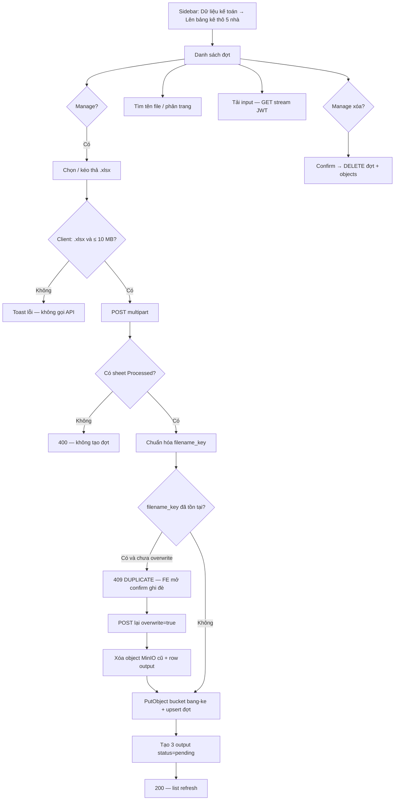

# BA Analysis: Lên bảng kê thô 5 nhà
**Ngày:** 2026-09-13
**Feature:** Hub lưu file input (workbook đã xử lý 5 nhà) và khung output theo nhà — sprint này **không** sinh bảng kê
**Nguồn:** grilling 2026-09-13; file mẫu `reference/xu_ly_du_lieu_ke_toan/`

---

## 1. Tổng quan

Kế toán đã có **Xử lý data 5 nhà** (`/delivery-data/5-houses`) — xử lý trên trình duyệt, **không lưu file** cho người khác — và **Import 5 nhà** — lưu *dòng* vào DB, không lưu workbook.

**Lên bảng kê thô 5 nhà** là bước sau: nhận **file đã xử lý 5 nhà** (vd. `1-8.7.xlsx`: có `Sheet1` + `Processed` + sheet nhà), lưu tập trung trên MinIO, để user khác tải **đúng file** theo tên đợt. Mỗi nhà (ND-MCC, CLV, Calofic, …) là **module riêng**; sprint này chỉ khung + trạng thái **Chưa xử lý**.

**Không nằm trong sprint:** transform Excel; upload tay file output; gộp nhiều file input thành một đợt; permission theo nhà; AWS S3 (dùng MinIO hiện có).

**Khác Import 5 nhà:** không insert `delivery_data` / `accountant_invoices`. Input là workbook *processed*, không phải ERP thô.

---

## 2. User Stories

| ID | User Story | Actor | Permission |
|----|------------|-------|------------|
| US-01 | Upload một file `.xlsx` đã xử lý 5 nhà, hệ thống lưu đợt và cho đồng nghiệp thấy trong danh sách | Kế toán | `accounting_data.manage` |
| US-02 | Xem danh sách đợt, tìm theo tên file, phân trang | Kế toán / xem | `accounting_data.view` |
| US-03 | Tải lại **file input** đúng tên gốc | Mọi user có view | `accounting_data.view` |
| US-04 | Thấy 3 cột nhà ND-MCC / CLV / Calofic ở trạng thái **Chưa xử lý**; không có nút chạy module | View | `accounting_data.view` |
| US-05 | Upload trùng tên file → được hỏi ghi đè; confirm thì xóa input cũ + mọi output nhà rồi lưu file mới | Manage | `accounting_data.manage` |
| US-06 | Xóa một đợt (file MinIO + metadata) sau confirm | Manage | `accounting_data.manage` |

---

## 3. Flowchart TO-BE



---

## 4. Business Rules

| ID | Rule |
|----|------|
| BR-001 | Một đợt = **một file** upload. `1-8.7.xlsx` và `9-16.7.xlsx` là hai đợt độc lập. Không gộp tuần, không nhập khoảng ngày. |
| BR-002 | Định danh đợt = `filename_key`: basename (bỏ path), `trim`, **chữ thường**. `1-8.7.xlsx` ≡ `1-8.7.XLSX` ≡ ` 1-8.7.xlsx `. Unique toàn hệ thống. |
| BR-003 | Không extract / không hiển thị min–max ngày hóa đơn. User chọn đợt theo **tên file đã upload**. |
| BR-004 | Input bắt buộc: MIME/extension `.xlsx`, ≤ **10 MB**, workbook có sheet tên đúng **`Processed`**. Không bắt sheet nhà. Sheet `Processed` rỗng vẫn nhận. |
| BR-005 | Sprint này **không** chạy module nhà, **không** nhận upload output tay. Ba nhà `nd_mcc`, `clv`, `calofic` luôn hiện **Chưa xử lý**. Nút chạy module **không** có trên UI. |
| BR-006 | Hai nhà còn lại (khung 5 nhà) **chưa** tạo slot. Thêm sau cùng bảng `bang_ke_tho_outputs` / `house_code`. |
| BR-007 | Tên tải **input** = `original_filename` như lúc upload (giữ nguyên hoa/thường/khoảng trắng do user). |
| BR-008 | Tên tải **output** (khi module sau sinh file): `{prefix} {stem}.xlsx` với `stem` = `original_filename` bỏ đuôi `.xlsx` (giữ nguyên hoa/thường stem). Prefix cố định: `ND-MCC`, `clv`, `calofic`. Ví dụ input `1-8.7.xlsx` → `ND-MCC 1-8.7.xlsx`, `clv 1-8.7.xlsx`, `calofic 1-8.7.xlsx`. |
| BR-009 | Ghi đè: cùng `filename_key` + `overwrite=true` → xóa object input cũ, xóa **mọi** output (kể cả sprint sau đã `ready`/`failed`), rồi lưu input mới và reset 3 output về `pending`. |
| BR-010 | Trùng tên nhưng `overwrite` không gửi / `false` → **409** `BANG_KE_DUPLICATE`, body có `batch_id` + `original_filename` hiện tại. Không ghi file. |
| BR-011 | Xóa đợt: hard delete DB + xóa object MinIO (input + output). View không xóa. |
| BR-012 | Permission: `accounting_data.view` = list, search, tải input (và tải output khi `ready`). `accounting_data.manage` = upload, ghi đè, xóa. Không tạo permission mới. ADMIN bypass như hiện tại. |
| BR-013 | File lưu MinIO **bucket riêng** `phuphatcorp-bang-ke-tho` (env `MINIO_BANG_KE_BUCKET`). Không dùng bucket đăng kiểm. Không public ACL. Không `getPublicUrl` / static. |
| BR-014 | Tải file chỉ qua **API JWT**, stream `Content-Disposition: attachment`. Không trả URL MinIO cho browser. |
| BR-015 | **Tương lai — module:** lỗi validate/transform của một nhà chỉ set output nhà đó `failed` + `error_message`; các nhà khác và file input không đổi. Sprint này không implement transform. |
| BR-016 | Object key: `batches/{batch_id}/input.xlsx` và `batches/{batch_id}/outputs/{house_code}.xlsx`. |
| BR-017 | Hai upload trùng `filename_key` đồng thời: unique constraint; một thành công, cái còn lại 409. |

---

## 5. Data Model

Migration đề xuất: `046_create_bang_ke_tho.sql` (số thực tế = max hiện tại + 1).

### 5.1 `bang_ke_tho_batches`

| Column | Type | Ghi chú |
|--------|------|---------|
| `id` | UUID PK DEFAULT gen_random_uuid() | |
| `original_filename` | VARCHAR(255) NOT NULL | Tên hiển thị / tên tải input |
| `filename_key` | VARCHAR(255) NOT NULL UNIQUE | BR-002 |
| `input_object_key` | TEXT NOT NULL | Key trong bucket bang-ke |
| `input_size_bytes` | INTEGER NOT NULL | |
| `uploaded_by` | INTEGER NOT NULL REFERENCES users(id) | |
| `uploaded_at` | TIMESTAMPTZ NOT NULL DEFAULT NOW() | |
| `created_at` | TIMESTAMPTZ NOT NULL DEFAULT NOW() | |
| `updated_at` | TIMESTAMPTZ NOT NULL DEFAULT NOW() | |

Index: `filename_key` UNIQUE; `(uploaded_at DESC)` cho list.

### 5.2 `bang_ke_tho_outputs`

| Column | Type | Ghi chú |
|--------|------|---------|
| `id` | UUID PK | |
| `batch_id` | UUID NOT NULL REFERENCES bang_ke_tho_batches(id) ON DELETE CASCADE | |
| `house_code` | VARCHAR(32) NOT NULL | `nd_mcc` \| `clv` \| `calofic` (mở rộng sau) |
| `status` | VARCHAR(16) NOT NULL | `pending` \| `ready` \| `failed` |
| `download_filename` | VARCHAR(255) NOT NULL | BR-008, tính lúc tạo row |
| `object_key` | TEXT NULL | Chỉ khi `ready` |
| `error_message` | TEXT NULL | Khi `failed` |
| `generated_at` | TIMESTAMPTZ NULL | |
| `updated_at` | TIMESTAMPTZ NOT NULL DEFAULT NOW() | |

UNIQUE `(batch_id, house_code)`. CHECK `house_code` / `status`.

Lúc insert batch: luôn INSERT 3 row `pending` với `download_filename` theo BR-008.

### 5.3 MinIO

| Key | Default |
|-----|---------|
| `MINIO_BANG_KE_BUCKET` | `phuphatcorp-bang-ke-tho` |

Cùng `MINIO_ENDPOINT` / credentials hiện có. `ensureBucket` cho bucket này lúc upload đầu (hoặc startup). Mở rộng `storageService` nhận `bucket` — **không** ghi nhầm vào bucket inspections.

---

## 6. API Contract

Base: `/api/bang-ke-tho`. Envelope `{ success, message, data }`.

`house` trong JSON list:

```ts
{ house_code: 'nd_mcc' | 'clv' | 'calofic'; status: 'pending' | 'ready' | 'failed'; download_filename: string; error_message: string | null }
```

### 6.1 Upload đợt

```
POST /api/bang-ke-tho/batches
Auth: JWT + accounting_data.manage
Content-Type: multipart/form-data
Query: overwrite=true | false (default false)

file: File
```

**200** (tạo mới hoặc ghi đè thành công):

```json
{
  "success": true,
  "message": "Đã lưu file bảng kê thô",
  "data": {
    "id": "uuid",
    "original_filename": "1-8.7.xlsx",
    "filename_key": "1-8.7.xlsx",
    "input_size_bytes": 1355301,
    "uploaded_by_name": "Nguyen Van A",
    "uploaded_at": "2026-09-13T10:00:00.000Z",
    "houses": [
      { "house_code": "nd_mcc", "status": "pending", "download_filename": "ND-MCC 1-8.7.xlsx", "error_message": null },
      { "house_code": "clv", "status": "pending", "download_filename": "clv 1-8.7.xlsx", "error_message": null },
      { "house_code": "calofic", "status": "pending", "download_filename": "calofic 1-8.7.xlsx", "error_message": null }
    ]
  }
}
```

**400** thiếu `Processed` / không phải xlsx / >10MB: `message` tiếng Việt cụ thể.  
**409** trùng, chưa overwrite:

```json
{
  "success": false,
  "message": "Đã có đợt với tên file này. Ghi đè sẽ xóa file cũ và mọi bảng kê nhà.",
  "data": {
    "code": "BANG_KE_DUPLICATE",
    "batch_id": "uuid",
    "original_filename": "1-8.7.xlsx"
  }
}
```

**403** thiếu manage. **401** chưa đăng nhập.

### 6.2 Danh sách đợt

```
GET /api/bang-ke-tho/batches?page=1&limit=20&q=
Auth: JWT + accounting_data.view
```

`q`: ILIKE `%q%` trên `original_filename`. Sort `uploaded_at DESC`. Default `limit=20`, max 100.

**200** `data`: `{ data: Batch[], pagination: { page, limit, total, totalPages } }` — mỗi `Batch` cùng shape mục 6.1.

### 6.3 Tải input

```
GET /api/bang-ke-tho/batches/:id/files/input
Auth: JWT + accounting_data.view
```

Stream binary; `Content-Type: application/vnd.openxmlformats-officedocument.spreadsheetml.sheet`; `Content-Disposition: attachment; filename="..."` (RFC 5987 `filename*` nếu tên Unicode). **404** nếu không có đợt / object.

### 6.4 Tải output nhà (khung — sprint này luôn 409)

```
GET /api/bang-ke-tho/batches/:id/files/:houseCode
Auth: JWT + accounting_data.view
```

`houseCode` = `nd_mcc` | `clv` | `calofic`.  
`pending` → **409** `{ code: "BANG_KE_OUTPUT_PENDING" }`.  
`failed` → **409** `{ code: "BANG_KE_OUTPUT_FAILED", message: error_message }`.  
`ready` → stream như 6.3 với `download_filename`.  
Sai `houseCode` → **400**. Không có đợt → **404**.

FE sprint này **không** gọi endpoint này (nút disable). Vẫn implement để module sau khỏi đổi contract.

### 6.5 Xóa đợt

```
DELETE /api/bang-ke-tho/batches/:id
Auth: JWT + accounting_data.manage
```

**200** `{ success: true, message: "Đã xóa đợt", data: { id } }`. **404** nếu không còn. Best-effort xóa MinIO; nếu object đã mất vẫn xóa DB.

---

## 7. UI Screens

| # | Screen | Route | Mô tả |
|---|--------|-------|-------|
| 1 | Lên bảng kê thô 5 nhà | `/accounting-data/bang-ke-tho` | Dropzone (manage) + bảng đợt + tìm + phân trang |
| 2 | Confirm ghi đè | Modal | Khi 409 `BANG_KE_DUPLICATE` |
| 3 | Confirm xóa | Modal | Trước DELETE |

Chi tiết layout / state: `docs/ui/20260913_bang-ke-tho-5-nha-ui-spec.md`.

Sidebar: nhóm **Dữ liệu kế toán** (`showAccountingData`), cạnh Import 5 nhà. **Không** đặt dưới Delivery Data.

---

## 8. Edge Cases

| # | Case | Xử lý |
|---|------|-------|
| EC-01 | File `.xls` / csv / pdf | Client + server 400: chỉ `.xlsx` |
| EC-02 | > 10 MB | Client chặn; server 400 |
| EC-03 | Có sheet `processed` (thường) không có `Processed` | 400 — tên sheet **đúng** `Processed` |
| EC-04 | Workbook hỏng, không parse được | 400: "Không đọc được file Excel" |
| EC-05 | Tên file không có `.xlsx` nhưng MIME đúng | Vẫn nhận nếu extension `.xlsx`; không thì 400 |
| EC-06 | Tên rất dài / ký tự `\ / :` | Lưu `original_filename` cắt 255; `filename*` khi download |
| EC-07 | User view bấm upload (nếu lộ UI) | 403; FE ẩn dropzone / xóa |
| EC-08 | Xóa đợt đang có người tải | Download có thể 404 giữa chừng — chấp nhận |
| EC-09 | MinIO down lúc upload | 500; không để orphan DB (transaction: put MinIO trước, insert DB; fail DB thì xóa object) |
| EC-10 | MinIO down lúc xóa | Vẫn xóa DB; log lỗi object (tránh đợt “ma” chặn unique) |
| EC-11 | Ghi đè khi user khác đang xem list | List stale đến lần refetch; không lock |
| EC-12 | `q` không khớp | Empty state **trong bảng**: "Không tìm thấy đợt nào" — khác empty chưa từng upload |
| EC-13 | HOUSE sau này thêm `vfm` | Migration/seed output cho batch mới; batch cũ không tự thêm row (xử lý CR sau) |
| EC-14 | Session hết hạn lúc upload | 401 → login; file chưa lưu |

---

## 9. Acceptance Criteria

- [ ] User `accounting_data.manage` upload `1-8.7.xlsx` (có `Processed`) → đợt hiện trên list với 3 nhà **Chưa xử lý**; tải về trùng nội dung/tên gốc.
- [ ] User `accounting_data.view` xem list + tải input; không thấy nút upload/xóa; gọi POST/DELETE → 403.
- [ ] Upload `9-16.7.xlsx` khi đã có `1-8.7.xlsx` → hai đợt.
- [ ] Upload lại `1-8.7.xlsx` không overwrite → 409 + modal; hủy → file cũ nguyên. Confirm → file mới, output vẫn pending.
- [ ] Xóa đợt → khỏi list, GET download 404, upload cùng tên thành đợt mới (không 409).
- [ ] Thiếu sheet `Processed` → 400, không tạo đợt.
- [ ] Tìm theo một phần tên file hoạt động; phân trang `page` trên URL.
- [ ] Object nằm bucket `phuphatcorp-bang-ke-tho`; GET download không lộ host MinIO.
- [ ] Menu chỉ hiện với `accounting_data.view|manage` (hoặc ADMIN), trong nhóm kế toán.

---

## 10. Ngoài phạm vi (sprint sau)

- Module ND-MCC / CLV / Calofic (và VFM / nhà 5): đọc `Processed` + sheet nhà, ghi output `ready`/`failed`.
- File mẫu tham chiếu: `ND-MCC 1-16.7.xlsx`, `clv 1-8.7.xlsx`, `calofic 1-8.7.xlsx`.
- Upload output thủ công; gộp nhiều input; RBAC theo nhà.
