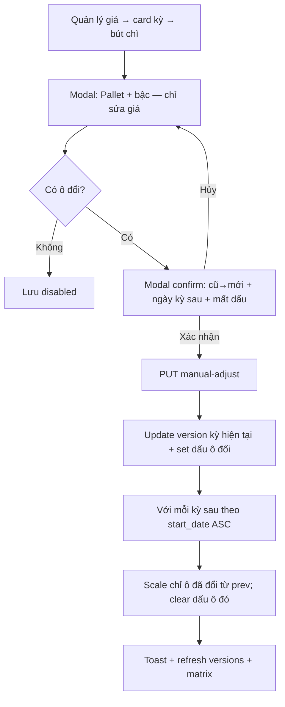

# BA Analysis: Sửa giá theo kỳ + cascade + đánh dấu đã điều chỉnh

**Ngày:** 2026-09-15  
**Feature:** Route pricing — manual adjust prices on any period  
**Module:** Giá theo tuyến (`route_pricing`)  
**Scope:** FULL  
**Phụ thuộc:** Kỳ điều chỉnh, bảng giá gốc / cascade %, ma trận, mode `by_weight` | `by_trips` | `by_truck`  
**Feature gốc:** `docs/ba/20260711_route-pricing-analysis.md`, CR kỳ `docs/ui/20260731_route-pricing-adjustment-periods-cr-ui-spec.md`  
**UI Spec:** `docs/ui/20260915_route-pricing-period-manual-adjust-ui-spec.md`  
**Nguồn:** Grill 2026-09-14/15 (shared understanding đã confirm)

**Thay bởi 2026-09-17:** Giá mới phải `> 0`. Ô trống không sinh record. Không điều chỉnh Pallet về `0`. Sửa giá gốc có confirm recascade. Bậc bộ chưa có trên kỳ dùng `added_tiers`. Chi tiết: `docs/ba/20260917_route-pricing-price-sets-analysis.md`. Các mục dưới mô tả CR 2026-09-15, không còn là luật lưu giá hiện tại ở chỗ mâu thuẫn.

---

## 1. Mô tả yêu cầu

Người dùng cần **chỉnh đơn giá một hoặc nhiều bậc (và/hoặc Pallet) trên bất kỳ kỳ nào** đã có version của nhóm tuyến — không chỉ kỳ gốc.

Khi lưu:
- Ghi đè giá trên version của kỳ đang sửa (không tạo version mới, không lịch sử số cũ).
- **Cascade** các kỳ sau: chỉ các ô vừa đổi; công thức = giá mới × (1 + % của từng kỳ), làm tròn nghìn, cộng dồn.
- **Đánh dấu** đúng ô đã gõ tay; ô chỉ bị cascade **không** gắn dấu (và nếu kỳ sau đã có dấu trên cùng ô thì mất dấu).

Đồng thời nới validate: **mọi bậc (kể kỳ đầu) và Pallet được phép giá ≥ 0** (trước đây bậc bắt buộc > 0; chỉ Pallet ≥ 0).

UI chính: tab **Quản lý giá** — mỗi card kỳ có nút bút chì → form bậc/Pallet → **modal confirm** trước khi gọi API. Ma trận chỉ xem + hiện dấu.

---

## 1.1 Phạm vi

**Trong scope**
- API sửa giá theo `versionId` (kỳ bất kỳ đã có version) + cascade kỳ sau cùng `price_config`
- Cột / flag đánh dấu đã điều chỉnh tay (Pallet + từng bậc)
- Validate giá bậc ≥ 0 (create absolute, update absolute, manual adjust)
- UI: bút chì trên card kỳ; modal edit; modal confirm; hiển thị dấu trên card + ma trận
- Hiển thị giá = 0 thành `-` trên card Quản lý giá và ma trận (form edit vẫn hiện số `0`)
- Trả flag dấu trên `GET .../versions` và `GET .../prices/matrix`

**Ngoài scope**
- Đổi cấu trúc bậc / mode / nhãn / khoảng / đơn vị từ form bút chì (vẫn chỉ qua **Sửa bảng giá gốc**)
- Lịch sử audit số cũ (ai sửa, lúc nào, giá trước)
- Confirm thêm khi **Sửa bảng giá gốc** dù kỳ sau mất dấu (đã chốt không confirm)
- Lookup Delivery / seed Excel
- Permission / role mới
- Sửa từ tab Ma trận
- Sửa kỳ chưa có version (không có card / không có bút chì)

---

## 1.2 Giả định (đã chốt grill)

| # | Quyết định |
|---|------------|
| A1 | Cascade: kỳ sau = giá mới × (1+% kỳ đó), `roundToThousands`, cộng dồn. Chỉ ô thực sự đổi. |
| A2 | Kỳ sau đã có dấu trên cùng ô → bị ghi đè + mất dấu; confirm liệt kê ngày kỳ đó. |
| A3 | Bút chì chỉ sửa đơn giá bậc hiện có + Pallet. |
| A4 | Giá ≥ 0 là giá thật; lookup/DB lưu 0. UI list/matrix hiện `-`. Form edit hiện `0`. |
| A5 | Dấu lưu DB trên ô đã gõ; cascade không gắn dấu. Dữ liệu cũ không có dấu. |
| A6 | Tab Quản lý giá + bút chì; ma trận view-only; giữ nút Sửa bảng giá gốc. |
| A7 | Ghi đè tại chỗ; không version history giá cũ. |
| A8 | Pallet đã điều chỉnh về 0: badge **"Pallet được điều chỉnh về 0"** (+ hiện `-`). |
| A9 | Confirm: ô đổi (cũ→mới) + **ngày** kỳ sau + kỳ mất dấu; **không** hiện giá mới đã tính của kỳ sau. |
| A10 | Không đổi gì → Lưu tắt; không confirm; không API. |
| A11 | Sửa bảng giá gốc: không confirm vì mất dấu kỳ sau. |
| A12 | Sửa gốc: không gắn dấu mới; giữ dấu trên ô kỳ gốc chỉ khi giá không đổi; ô đổi / bậc mới → không dấu. |
| A13 | Confirm dùng **Modal** (không `window.confirm`). |
| A14 | Ma trận: highlight nền ô đã điều chỉnh. Card: `*`/icon. Pallet→0: badge chữ cố định. |
| A15 | Số nhập tay = VND nguyên (không bắt tròn nghìn); cascade mới làm tròn nghìn. |
| A16 | Role: `route_pricing.manage` sửa; `view` chỉ xem dấu. |
| A17 | Áp dụng cả 3 mode. Khớp bậc kỳ sau bằng fingerprint cột hiện có (weight / trips / truck key); Pallet = field riêng. |

---

## 1.3 Flowchart TO-BE



**Sửa bảng giá gốc (giữ hành vi xóa + rebuild kỳ sau):** không set dấu mới; preserve dấu trên absolute chỉ khi price không đổi; clear mọi version/dấu kỳ sau như hiện tại.

---

## 2. Actors & Permissions

| Actor | Permission | Hành vi |
|-------|------------|---------|
| Kế toán / Admin | `route_pricing.manage` | Bút chì, confirm, lưu; tạo/sửa absolute |
| Viewer | `route_pricing.view` | Xem giá, `-` khi 0, dấu trên card/ma trận; không bút chì |

Không thêm permission code.

---

## 3. Business Rules

```
BR-MA-001: Chỉ sửa được version đã tồn tại (mọi kỳ gắn adjustment_period_id
           của cùng price_config). Không tạo version mới từ bút chì.

BR-MA-002: Payload manual-adjust gửi snapshot đầy đủ pallet_trip_price +
           tiers[].id + tiers[].price (đủ mọi bậc của version). BE diff với
           DB: chỉ ô có số khác nhau mới cascade / gắn dấu.
           Không đổi: pricing_mode, label, range_*, pricing_unit, min_billable_ton,
           số lượng / thứ tự bậc. Thiếu tier id / id không thuộc version → 400.

BR-MA-003: Giá bậc và Pallet: number, finite, ≥ 0 (integer VND sau làm sạch).
           Áp dụng createAbsolute, updateAbsolute, manual-adjust, Zod/express
           validator (đổi isFloat gt:0 → min:0 cho tier.price).

BR-MA-004: Trên kỳ đang sửa: UPDATE giá; set is_manual_adjusted = true trên
           mỗi ô (tier hoặc pallet) vừa đổi. Ô không đổi: giữ giá + giữ flag.

BR-MA-005: Kỳ sau (cùng price_config, period.start_date > kỳ sửa), theo ASC:
           Với mỗi ô đã đổi ở bước sửa:
             new = roundToThousands(prevValue * (1 + period.percent/100))
             UPDATE giá ô khớp fingerprint; is_manual_adjusted = false
           Ô không nằm trong tập đổi: không UPDATE giá, không đụng flag.
           Khớp bậc: weightTierColumnKey / (range_from,range_to) trips /
           truckTierColumnKey. Thiếu bậc khớp ở kỳ sau → bỏ qua ô đó (không lỗi).

BR-MA-006: Không xóa/recreate version khi manual-adjust (tránh mất giá/dấu
           bậc không đụng).

BR-MA-007: updateAbsolute (sửa gốc): giữ delete+rebuild kỳ sau như hiện tại.
           Trên absolute: sau update tiers/pallet —
             - Ô giá không đổi so với trước khi sửa: giữ is_manual_adjusted
             - Ô giá đổi hoặc bậc mới: is_manual_adjusted = false
             - Bậc bị xóa: mất theo cascade delete
           Kỳ sau mới tạo từ scale: mọi is_manual_adjusted = false.

BR-MA-008: createAbsolute / create period cascade: version mới flag = false.

BR-MA-009: Hiển thị (FE): giá == 0 → "-" trên card Quản lý giá và ma trận.
           Form bút chì / form absolute: hiện số 0.
           Card: Pallet == 0 và !pallet_manual → ẩn dòng Pallet (như hiện tại).
           Pallet == 0 và pallet_manual → hiện dòng badge
           "Pallet được điều chỉnh về 0" (+ "-").

BR-MA-010: Không có thay đổi số → FE không gọi API (Lưu disabled).

BR-MA-011: Confirm trước manual-adjust (modal). Nội dung:
           - Danh sách ô đổi: label bậc hoặc "Pallet", giá cũ → giá mới
             (giá 0 trong confirm vẫn hiện số 0 hoặc "-" — chốt UI Spec: số 0)
           - Danh sách ngày bắt đầu các kỳ sau sẽ bị cascade
           - Trong danh sách đó, kỳ có is_manual_adjusted trên cùng ô đổi:
             ghi chú sẽ mất dấu
           Không liệt kê giá mới đã tính của kỳ sau.
```

---

## 4. Use Cases & Acceptance Criteria

### UC-1: Sửa một bậc ở kỳ giữa + cascade
**Acceptance:**
- [ ] Bút chì trên kỳ không phải gốc → đổi 1 bậc → confirm → lưu
- [ ] Kỳ đó: giá mới + dấu trên bậc đó
- [ ] Kỳ sau: giá scale từ giá mới; không dấu; bậc khác không đổi
- [ ] Kỳ trước không đổi

### UC-2: Sửa nhiều ô cùng lúc (bậc + Pallet)
**Acceptance:**
- [ ] Diff nhiều ô → cascade từng ô độc lập
- [ ] Confirm liệt kê đủ ô đổi

### UC-3: Ghi đè dấu kỳ sau
**Acceptance:**
- [ ] Kỳ 3 đã có dấu trên bậc A; sửa bậc A ở kỳ 2 → confirm ghi kỳ 3 mất dấu
- [ ] Sau lưu: kỳ 3 bậc A giá mới, `is_manual_adjusted=false`

### UC-4: Giá ≥ 0
**Acceptance:**
- [ ] Tạo/sửa absolute và manual-adjust chấp nhận tier.price = 0 và pallet = 0
- [ ] price < 0 → 400
- [ ] Card/matrix hiện `-` khi 0
- [ ] Pallet 0 không manual: ẩn dòng trên card; matrix cột pallet hiện `-`

### UC-5: Không đổi → không lưu
**Acceptance:**
- [ ] Mở form, không sửa → Lưu disabled
- [ ] Đổi rồi đổi lại về số cũ → Lưu disabled

### UC-6: Sửa bảng giá gốc vs dấu
**Acceptance:**
- [ ] Không modal confirm thêm vì mất dấu kỳ sau
- [ ] Absolute: ô không đổi giá giữ dấu; ô đổi/bậc mới không dấu
- [ ] Kỳ sau rebuild: không dấu

### UC-7: View-only + ma trận
**Acceptance:**
- [ ] Không `manage` → không bút chì
- [ ] Matrix highlight ô có flag; không nút sửa
- [ ] Card: `*`/icon cạnh giá đã điều chỉnh (khác Pallet→0)

### UC-8: Regression
**Acceptance:**
- [ ] Thêm kỳ / xóa kỳ gần nhất / tạo absolute cascade vẫn pass
- [ ] Tests mode by_weight / by_trips / by_truck cũ cập nhật assert price > 0 → ≥ 0 nơi cần

---

## 5. Data Model (delta)

```sql
ALTER TABLE route_price_versions
  ADD COLUMN IF NOT EXISTS pallet_manual_adjusted BOOLEAN NOT NULL DEFAULT FALSE;

ALTER TABLE route_price_tiers
  ADD COLUMN IF NOT EXISTS is_manual_adjusted BOOLEAN NOT NULL DEFAULT FALSE;
```

Không bảng lịch sử. Index không bắt buộc (flag đọc kèm version/tier).

---

## 6. API Contract (delta)

### Mới: `PUT /api/route-pricing/prices/versions/:versionId/manual-adjust`

**Auth:** `route_pricing.manage`

**Body:**
```json
{
  "pallet_trip_price": 0,
  "tiers": [
    { "id": 101, "price": 2000000 },
    { "id": 102, "price": 0 }
  ]
}
```

**Rules:** `tiers` phải đủ và đúng tập id của version; chỉ `price` / `pallet_trip_price` được đổi.

**Response `data`:** version sau sửa (kỳ hiện tại) kèm tiers + flags — cùng shape list versions.

**Errors:** `NOT_FOUND`, `INVALID_TIERS` (giá < 0, thiếu id, thừa id), 403 thiếu permission.

### Cập nhật validators
- `priceCreateSchema` / `priceUpdateAbsoluteSchema`: `tiers.*.price` `isFloat({ min: 0 })` (không còn `gt: 0`).

### `GET /prices/:configId/versions`
Mỗi version thêm `pallet_manual_adjusted: boolean`.  
Mỗi tier thêm `is_manual_adjusted: boolean`.

### `GET /prices/matrix`
Mỗi ô giá cần kèm flag (không phá client cũ nếu thêm song song):

**Cách chốt:** mở rộng cells từ số | null thành object:

```ts
// Breaking nhỏ có chủ đích — FE matrix + manage cùng release
cells[periodId][columnKey] = { value: number | null; manual_adjusted: boolean }
// trips rows:
cells[periodId] = { value: number | null; manual_adjusted: boolean }
```

Hoặc giữ số và thêm map song song `manual_flags` cùng shape — **chốt implement: object `{ value, manual_adjusted }`** (một release FE+BE).

---

## 7. UI/UX requirements (tóm tắt — chi tiết UI Spec)

| Thành phần | Yêu cầu |
|------------|---------|
| Card kỳ | Nút Pencil (manage); giá 0 → `-`; dấu `*`/icon; Pallet→0 manual → badge chữ |
| Modal edit | Prefill mọi bậc + Pallet (số); chỉ input giá; Lưu disabled nếu không dirty |
| Modal confirm | List cũ→mới; ngày kỳ sau; mất dấu; Hủy / Xác nhận |
| Ma trận | `value===0` → `-`; `manual_adjusted` → highlight nền; Pallet 0 + flag → badge/tooltip chữ cố định nếu cần trong ô |
| Absolute form | Cho nhập giá bậc ≥ 0; không thêm confirm mất dấu |

---

## 8. Risks & Notes

| Risk | Mitigation |
|------|------------|
| Breaking matrix cell shape | Ship FE+BE cùng PR; cập nhật types/hooks |
| Sửa gốc xóa dấu kỳ sau không confirm | Đã chốt A11; ghi rõ trong UI Spec / user guide sau |
| Kỳ sau thiếu bậc khớp | Skip ô; không fail cả transaction |
| Làm tròn nghìn lệch kỳ này sang kỳ sau | Giữ `roundToThousands` hiện có |

---

## 9. Files ảnh hưởng (dự kiến)

```
backend/src/migrations/046_route_pricing_manual_adjust.sql
backend/src/services/routePricingService.ts
backend/src/controllers/routePricingController.ts
backend/src/routes/routePricing.ts
backend/src/types/routePricing.ts
backend/src/__tests__/routePricingService.test.ts
frontend/src/api/routePricingApi.ts
frontend/src/hooks/useRoutePricing.ts
frontend/src/pages/route-pricing/RoutePricingPage.tsx
frontend/src/pages/route-pricing/PriceMatrixTab.tsx
frontend/src/i18n/vi.json, en.json
.opencode/knowhow/know-how.md
.opencode/knowhow/system-features.md
```
