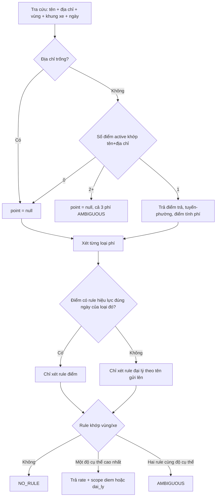

# BA Analysis: Phụ phí giao hàng

**Ngày:** 2026-09-17  
**Feature:** Phụ phí khách hàng — bốc xếp, phụ phí giao hàng, chuyển tải  
**Module:** Quản lý giá cước vận tải (`route_pricing`)  
**Scope:** FULL  
**Phụ thuộc:** `customers` (tên, địa chỉ, điểm trả, tuyến-phường, điểm giao hàng tính phí)  
**Nguồn:** Grill 2026-09-17. Cùng ngày bổ sung: tạo nhiều tên khách một lần, và xóa cứng. Không tạo file BA mới.

---

## 1. Mô tả yêu cầu

Kế toán cần một biểu phí theo khách, tách khỏi giá cước tuyến. Cùng một đại lý có thể có đơn giá khác nhau theo vùng và khung xe, và một cửa hàng có thể lệch khỏi mức mặc định của đại lý.

Ví dụ Bách Hóa Xanh: bốc xếp nội thành, xe ≤2.5 tấn là 200.000đ/tấn. Đi tỉnh là 120.000đ/tấn. Phụ phí giao hàng đi tỉnh là 270.000đ/chuyến. Cửa hàng G16/108A có thể có dòng riêng.

Phiên bản này chỉ quản lý biểu phí và tra cứu. Chưa cộng tiền vào xử lý data giao hàng.

---

## 1.1 Phạm vi

**Trong scope**

- Trang riêng **Phụ phí giao hàng** trong accordion Quản lý giá cước vận tải.
- Ba loại phí: bốc xếp, phụ phí giao hàng, chuyển tải.
- Rule mặc định theo tên khách, override theo một điểm trả.
- Điều kiện vùng và khung xe. Ô trống = mọi giá trị.
- Hiệu lực theo ngày. Sửa giá là đóng dòng cũ, mở dòng mới.
- API tra cứu: tên + địa chỉ, vùng, khung xe, ngày. Trả cả ba phí và, khi khớp đúng một điểm, điểm trả hàng, tuyến-phường, điểm giao hàng tính phí.
- Bỏ checkbox và cột “Bốc xếp” trên màn khách hàng. Import Excel khách không còn ghi cờ này.
- Link từ danh sách khách sang trang này, lọc theo tên.
- Một lần tạo áp cùng một bộ số cho nhiều tên khách (giá đại lý).
- Xóa cứng từng phụ phí, kể cả phụ phí đã ngừng. Ngừng áp dụng vẫn giữ.

**Ngoài scope**

- Phí ghép điểm.
- Gắn lookup vào `processDeliveryData` hoặc hóa đơn.
- `GET /route-pricing/lookup` vẫn `LOOKUP_DEFERRED`. Không dùng lại endpoint đó.
- Import Excel biểu phí.
- Kỳ điều chỉnh phần trăm, bảng giá, nhóm tuyến, ma trận.
- Permission mới. Dùng `route_pricing.view` / `route_pricing.manage`.
- `trip_codes.boc_xep` không đổi.
- Không xóa cột `customers.boc_xep`. Cột còn trong DB, UI và import không còn dùng.
- Không trả `tuyen_cu`, không trả `customer_id` trong kết quả tra cứu.
- Không chọn tất cả tên. Không giới hạn số tên bằng một nút, cũng không đặt trần số tên.
- Không hoàn tác đổi giá khi xóa. Không mục “đã xóa” trên trang phụ phí.
- Không audit lúc tạo, đổi giá, ngừng.
- Không đưa nhà cung cấp vào khóa rule. Tra cứu được gửi mã tùy chọn. Không gắn vào xử lý data giao hàng.
- Mobile.

---

## 1.2 Giả định đã chốt

| # | Quyết định |
|---|------------|
| A1 | Trang nằm cạnh Kỳ điều chỉnh / Bộ giá / Quản lý tuyến / Bảng giá. Không phải tab của một bảng giá. |
| A2 | Đại lý = chuỗi `ten_khach_hang` đang có trên khách active. Chọn từ danh sách, không gõ tự do. So khớp trim, không phân biệt hoa thường. Không gom khoảng trắng bên trong. |
| A3 | Override lưu `customer_id`. Không lưu bản sao địa chỉ. Form chọn điểm trả. Điểm không có `dia_chi_giao_hang` thì không tạo override. |
| A4 | Tra cứu nhận `ten_khach_hang` + `dia_chi_giao_hang`, và `supplier_code` tùy chọn. Không nhận `customer_id`. Khớp điểm: `trim` + `toLowerCase` trên tên, địa chỉ và mã. Mã trống hoặc chỉ khoảng trắng thì bỏ qua. |
| A5 | Không ra điểm, hoặc địa chỉ gửi lên trống: ba trường điểm là null. Đơn giá đại lý vẫn trả nếu có. Không gửi mã và hai điểm active cùng tên cùng địa chỉ: không trả trường điểm, cả ba phí `AMBIGUOUS`. Có gửi mã: chỉ giữ điểm đúng `supplier_code`. Còn một điểm thì khớp điểm đó. Không còn điểm nào thì `NO_POINT` và phí đại lý, không lấy điểm của mã khác. Còn hai điểm cùng mã thì vẫn `AMBIGUOUS`. |
| A6 | Chỉ xét rule còn hiệu lực đúng `on_date`. Cửa hàng còn ít nhất một rule hiệu lực của loại phí đó thì không trộn với giá đại lý. Hết hạn thì rơi về đại lý. |
| A7 | Trong cùng một tầng, rule điền nhiều điều kiện hơn thắng rule để trống. Hai rule cùng độ cụ thể và cùng khớp một truy vấn thì `AMBIGUOUS`. Ghi rule mới nếu tạo ra tình huống đó thì 409. |
| A8 | Bốc xếp đơn vị `tan`. Phụ phí giao hàng và chuyển tải đơn vị `chuyen`. Client không chọn đơn vị. API trả đơn giá, không nhân tấn, không đếm lần đổi xe. `chuyen` của chuyển tải là tạm. |
| A9 | Số nguyên đồng, từ 0 trở lên. 0 là giá thật. Không có rule là `rate: null`, `reason: NO_RULE`. |
| A10 | Một combo đang mở chỉ một dòng (`end_date` null). Sửa giá: `start_date` mới sau `start_date` dòng đang mở. BE đóng dòng cũ vào ngày hôm trước. Khoảng trống do ngừng rồi tạo lại thì lookup `NO_RULE` ở khoảng đó, hoặc rơi về đại lý nếu là override đã hết hạn. |
| A11 | Dòng đã đóng không sửa số tiền. Đổi tên khách trên master không sửa rule đại lý. Muốn theo tên mới thì đóng rule cũ, tạo rule mới. |
| A12 | Vùng do phía gọi truyền: `noi_thanh` hoặc `tinh`. Module không suy từ `inner_city_customers` hay địa chỉ. Khung xe: `le_2_5`, `gt_8_16`, `gt_16_23`, `pallet` — cùng nghĩa với nhãn `≤2.5 tấn`, `>8-16 tấn`, `>16-23 tấn`, `Pallet` trong xử lý data giao hàng. |
| A13 | Khách deactive không tham gia khớp điểm. Rule override của điểm đó còn trên danh sách, lookup không dùng, rơi về đại lý nếu không còn override hiệu lực. Không chặn deactive khách. |
| A14 | Không seed số. Chuyển tải tạo được trên form khi user có số. |
| A15 | Tạo nhận một hoặc nhiều tên đại lý. Cùng loại phí, vùng, khung xe, số tiền, ngày bắt đầu. Mỗi tên một bản ghi `customer_id` null. |
| A16 | Đúng một tên thì vẫn chọn được một điểm trả. Từ hai tên trở lên không gắn điểm. Gửi `customer_id` kèm từ hai tên → 400. |
| A17 | Một transaction. Một tên không hợp lệ thì không ghi bản ghi nào. Báo đủ tên và mã lỗi, theo thứ tự body. |
| A18 | Xóa cứng từng bản ghi, đang mở hoặc đã ngừng. Không mở lại bản ghi cũ cùng combo. Tra cứu không còn ra số của bản ghi đã xóa. Giá điểm bị xóa mà điểm không còn bản ghi hiệu lực cùng loại thì rơi về đại lý. |
| A19 | Ngừng vẫn là cách kết thúc có ngày và giữ bản ghi. Xóa và Ngừng cùng tồn tại. |
| A20 | Xóa thành công ghi `audit_log`. Tạo, đổi giá, ngừng, xóa thất bại không ghi. Danh sách và tra cứu không đọc audit. |
| A21 | Câu mới trên UI nói “phụ phí”, không nói “dòng”. Không sửa câu cũ. |

---

## 1.3 Flowchart TO-BE



---

## 2. Data model

```text
customer_surcharge_rules (
  id              SERIAL PK,
  ten_khach_hang  VARCHAR(255) NOT NULL,     -- snapshot tên lúc tạo; đại lý match theo cột này
  customer_id     INTEGER NULL FK → customers(id),  -- NULL = mặc định đại lý
  fee_type        VARCHAR(30) NOT NULL,      -- boc_xep | phu_phi_giao_hang | chuyen_tai
  zone            VARCHAR(20) NULL,          -- NULL | noi_thanh | tinh
  vehicle_class   VARCHAR(20) NULL,          -- NULL | le_2_5 | gt_8_16 | gt_16_23 | pallet
  amount          INTEGER NOT NULL CHECK (amount >= 0),
  pricing_unit    VARCHAR(10) NOT NULL,      -- tan | chuyen, do server gán theo fee_type
  start_date      DATE NOT NULL,
  end_date        DATE NULL,                 -- NULL = đang mở
  created_by, updated_by, created_at, updated_at
)
```

Không unique đơn trên `(customer_id, fee_type, zone, vehicle_class)` vì lịch sử đóng/mở. Ràng buộc “một dòng mở” và “không chồng ngày” do service. Index phục vụ lookup theo `lower(trim(ten_khach_hang))`, `customer_id`, `fee_type`, `start_date`, `end_date`.

`pricing_unit`: `boc_xep` → `tan`. Hai loại còn lại → `chuyen`.

Khóa đại lý khi so khớp: `lower(trim(ten_khach_hang))`. `customer_id` null.

Khóa điểm: `customer_id` not null. `ten_khach_hang` trên dòng override là snapshot để lọc danh sách, không dùng làm khóa lookup của override.

---

## 3. Business rules

- **BR-CS-001:** List/create dùng quyền `route_pricing.view` / `route_pricing.manage`. Không permission mới.
- **BR-CS-002:** Tên đại lý phải khớp đúng một nhóm `ten_khach_hang` của khách `active` sau trim và lower. Không có tên đó → 400 `CUSTOMER_NAME_UNKNOWN`.
- **BR-CS-003:** Rule điểm bắt buộc `customer_id` của khách `active`, tên khớp tên đại lý đã chọn, và `dia_chi_giao_hang` không trống. Sai tên → 400 `POINT_NAME_MISMATCH`. Không địa chỉ → 400 `POINT_WITHOUT_ADDRESS`.
- **BR-CS-004:** `amount` là số nguyên ≥ 0. Số thập phân hoặc âm → 400 `INVALID_AMOUNT`. Đơn vị client gửi bị bỏ qua. Server gán theo `fee_type`.
- **BR-CS-005:** `zone` chỉ `noi_thanh` hoặc `tinh`, hoặc null. `vehicle_class` chỉ bốn mã ở A12, hoặc null. Giá trị khác → 400.
- **BR-CS-006:** Combo = tầng (đại lý theo tên, hoặc một `customer_id`) + `fee_type` + `zone` (null là một giá trị) + `vehicle_class` (null là một giá trị). Chỉ một dòng `end_date` null cho mỗi combo. Tạo khi đã có dòng mở → 409 `RULE_OPEN_EXISTS`. Phải đổi giá hoặc ngừng trước.
- **BR-CS-007:** Đổi giá chỉ trên dòng đang mở. `start_date` mới > `start_date` cũ. BE set `end_date` cũ = ngày trước `start_date` mới, insert dòng mới cùng combo, `end_date` null. Dòng đã đóng → 409 `CLOSED_RULE_IMMUTABLE`. Không cho sửa số tiền tại chỗ.
- **BR-CS-008:** Ngừng áp dụng chỉ trên bản ghi đang mở. `end_date` do user chọn, mặc định hôm nay, phải ≥ `start_date`. Ngừng không xóa bản ghi. Xóa cứng là BR-CS-019.
- **BR-CS-009:** Tạo dòng mới khi combo đã đóng: `start_date` > `end_date` của dòng đóng gần nhất. Nếu lớn hơn `end_date + 1` ngày, khoảng giữa là không có rule. Chồng ngày với bất kỳ dòng cùng combo → 409 `RULE_OVERLAP`.
- **BR-CS-010:** Cùng tầng, cùng `fee_type`, khoảng ngày chồng, cấm lưu nếu hai rule cùng khớp một truy vấn với cùng số điều kiện đã điền. Trường hợp bắt buộc chặn: cùng `(zone, vehicle_class)`, hoặc một rule chỉ có vùng và một rule chỉ có khung xe. Rule cụ thể hơn (điền thêm điều kiện) được sống cùng rule tổng quát hơn. Vi phạm → 409 `RULE_AMBIGUOUS`.
- **BR-CS-011:** Lookup `on_date` bắt buộc. Rule hiệu lực khi `start_date <= on_date` và (`end_date` null hoặc `end_date >= on_date`).
- **BR-CS-012:** Sau khi chọn tầng (BR-CS-013), chỉ giữ rule khớp vùng và khung xe: giá trị null của rule khớp mọi giá trị phía gọi. Rule không null phải bằng giá trị phía gọi. Lấy nhóm có số ô không-null cao nhất. Đúng một rule → trả `rate`, `unit`, `scope`. Nhiều hơn một → `AMBIGUOUS`. Không có → `NO_RULE`.
- **BR-CS-013:** Với mỗi `fee_type`, nếu điểm đã khớp và điểm đó có ít nhất một rule hiệu lực của loại đó thì `scope` xét ở tầng điểm, không xét đại lý. Ngược lại xét rule đại lý khớp `lower(trim(tên gửi lên))` và `customer_id` null. Điểm có rule tỉnh đang mở không làm lookup nội thành rơi về giá đại lý.
- **BR-CS-014:** Khớp điểm chỉ trên khách `status = active`. Địa chỉ sau trim là chuỗi rỗng → không khớp điểm. So sánh tên và địa chỉ: trim, lower, không suy diễn gần đúng.
- **BR-CS-015:** Response luôn có đủ ba loại phí. Không nhân `amount` với tấn. Không trả `customer_id`, `tuyen_cu`. `scope` là `diem` hoặc `dai_ly` khi có rate. Không có rate thì `scope` null.
- **BR-CS-016:** Đổi tên hoặc địa chỉ trên khách không cập nhật rule. Lookup override vẫn theo `customer_id` sau khi đã khớp điểm bằng tên và địa chỉ mới. Rule đại lý vẫn theo chuỗi cũ cho đến khi user đóng và tạo lại.
- **BR-CS-017:** Form và upload khách không ghi `boc_xep`. API khách vẫn nhận field để client cũ không vỡ. Giá trị gửi lên bị bỏ qua, cột giữ nguyên. Không dùng cờ này để chặn phí bốc xếp.
- **BR-CS-018:** Không seed. Không gọi tra cứu này từ xử lý data giao hàng.
- **BR-CS-019:** Xóa cứng `DELETE /route-pricing/surcharges/:id`, quyền `route_pricing.manage`. Đang mở hoặc đã ngừng đều xóa được. Chỉ xóa đúng id đó. Bản ghi đã ngừng cùng combo không được mở lại. Id không có → 404 `SURCHARGE_NOT_FOUND`. Thành công ghi audit `DELETE`, `entityType` `customer_surcharge_rule`, `details` gồm `ten_khach_hang`, `customer_id`, `fee_type`, `zone`, `vehicle_class`, `amount`, `pricing_unit`, `start_date`, `end_date`. Không ghi audit khi tạo, đổi giá, ngừng, hoặc xóa lỗi. Không bảng nào tham chiếu id này.
- **BR-CS-020:** Tạo nhiều tên: body `ten_khach_hangs` (mảng, ít nhất một phần tử). Client cũ chỉ gửi `ten_khach_hang` thì coi là mảng một phần tử. Có `ten_khach_hangs` thì bỏ qua `ten_khach_hang`. Tên trùng sau `lower(trim)` trong cùng request chỉ tạo một bản ghi. `customer_id` chỉ khi còn đúng một tên sau khi gom. Từ hai tên mà vẫn gửi `customer_id` → 400 `POINT_NOT_ALLOWED_FOR_BATCH`, không có `failures`. Không nút chọn tất cả, không trần số tên.
- **BR-CS-021:** Tạo nhiều tên là một transaction. Kiểm đủ mọi tên trước khi ghi. Lỗi theo tên: `CUSTOMER_NAME_UNKNOWN`, `RULE_OPEN_EXISTS`, `RULE_OVERLAP`, `RULE_AMBIGUOUS`. Có ít nhất một lỗi thì rollback. `data.failures` là `{ ten_khach_hang, code }[]` theo thứ tự body sau khi gom trùng. HTTP 409 nếu có lỗi xung đột. HTTP 400 nếu mọi lỗi là `CUSTOMER_NAME_UNKNOWN`. Lỗi chung (số tiền, loại phí, vùng, ngày) trả như tạo một tên, không có `failures`. Tạo, đổi giá, ngừng vẫn không ghi audit.

---

## 4. Use cases

### UC-01 Tạo giá mặc định đại lý

- **Actor:** user có `route_pricing.manage`
- **Pre:** tên khách đang có trên khách active
- **Post:** một dòng mở, `customer_id` null, hiện trên danh sách

### UC-02 Tạo giá riêng một cửa hàng

- **Actor:** manage
- **Pre:** chọn điểm có địa chỉ, thuộc đúng tên đại lý
- **Post:** dòng mở gắn `customer_id`. Lookup đúng tên + địa chỉ điểm đó dùng dòng này cho loại phí đó, không dùng giá đại lý

### UC-03 Đổi giá

- **Actor:** manage
- **Pre:** dòng đang mở. Ngày mới sau ngày bắt đầu cũ
- **Post:** dòng cũ đóng vào hôm trước ngày mới. Dòng mới cùng điều kiện, số tiền mới. Ngày tra cứu trước ngày mới vẫn lấy số cũ

### UC-04 Ngừng áp dụng

- **Actor:** manage, confirm
- **Post:** `end_date` đã set. Sau ngày đó combo này không khớp. Nếu là override duy nhất của loại phí thì lookup rơi về đại lý

### UC-05 Tra cứu

- **Actor:** user có `route_pricing.view`
- **Post:** thấy điểm (nếu khớp một) và ba kết quả phí. Không ghi dữ liệu

### UC-06 Xem từ danh sách khách

- **Actor:** user có cả quyền khách và `route_pricing.view`
- **Post:** mở trang phụ phí, lọc sẵn theo tên khách đó

### UC-07 User chỉ xem

- **Actor:** `route_pricing.view` không có `manage`
- **Post:** thấy danh sách và tra cứu. Không thấy Thêm, Đổi giá, Ngừng, Xóa

### UC-08 Tạo cùng một phí cho nhiều tên

- **Actor:** manage
- **Pre:** tick ít nhất hai tên trong danh sách khách active. Không chọn điểm trả
- **Post:** mỗi tên một bản ghi đang mở, cùng điều kiện và cùng số tiền, `customer_id` null. Một tên không hợp lệ thì không có bản ghi mới nào

### UC-09 Xóa cứng

- **Actor:** manage, confirm
- **Pre:** một bản ghi đang mở hoặc đã ngừng
- **Post:** bản ghi không còn trên danh sách và không còn tham gia tra cứu. Bản ghi cũ đã ngừng cùng combo vẫn đóng. Audit có snapshot. User chỉ có view không xóa được

---

## 5. Acceptance criteria

- [ ] Menu **Phụ phí giao hàng** nằm trong accordion Quản lý giá cước vận tải, route riêng, không cần chọn bảng giá.
- [ ] Tạo được rule BHX: bốc xếp nội thành ≤2.5 tấn 200000 `tan`, bốc xếp tỉnh 120000 `tan`, phụ phí giao hàng tỉnh 270000 `chuyen`. Lookup nội thành ≤2.5 tấn trả bốc xếp 200000 scope `dai_ly` và phụ phí `NO_RULE`.
- [ ] Override cửa hàng: lookup đúng địa chỉ lấy giá cửa hàng. Lookup cửa hàng khác cùng tên lấy giá đại lý.
- [ ] Điểm không có địa chỉ: không tạo được override.
- [ ] Gõ tên không có trong khách active: 400.
- [ ] Hai rule cùng tầng, một chỉ vùng và một chỉ khung xe, ngày chồng: 409.
- [ ] Đổi giá không sửa dòng cũ. Tra cứu ngày trước ngày mới vẫn ra số cũ.
- [ ] Khoảng trống sau khi ngừng: `NO_RULE`. Override hết hạn: rơi về đại lý, không bị chặn bởi dòng đã đóng.
- [ ] Hai điểm active trùng tên và địa chỉ, không gửi mã: tra cứu `AMBIGUOUS`, không chọn đại.
- [ ] Gửi mã đúng một trong hai điểm trùng địa chỉ: khớp điểm đó. Mã không khớp điểm nào: `NO_POINT`, phí đại lý. Hai điểm cùng mã: `AMBIGUOUS`.
- [ ] Form và bảng hiện tên nhà cung cấp lấy lúc đọc từ danh mục, không lưu trên rule.
- [ ] `amount` 0 lưu được và trả 0. Không có rule thì `rate` null, không trả 0.
- [ ] Response có `diem_tra_hang`, `tuyen_phuong`, `diem_giao_hang_tinh_phi` khi khớp một điểm, kể cả giá đang lấy từ đại lý. Không có `tuyen_cu`.
- [ ] Form khách và bảng khách không còn bốc xếp. Upload Excel không ghi cờ. Cột DB còn. `trip_codes.boc_xep` không đổi.
- [ ] User view không tạo/sửa/ngừng/xóa được.
- [ ] Một lần tạo tick nhiều tên, cùng bộ số, không gắn điểm. Một transaction. Một tên đã có phụ phí đang mở cùng điều kiện thì không tạo tên nào, form liệt kê đủ tên và lý do.
- [ ] Chọn đúng một tên vẫn tạo được giá một điểm trả. Từ hai tên, form không còn phần điểm trả.
- [ ] Xóa phụ phí đang mở không mở lại phụ phí đã ngừng. Tra cứu sau ngày kết thúc của phụ phí cũ là `NO_RULE`, trừ khi còn bản ghi khác khớp.
- [ ] Xóa giá điểm, điểm không còn bản ghi hiệu lực cùng loại: tra cứu lấy giá đại lý.
- [ ] Xóa phụ phí đã ngừng: tra cứu ngày cũ của phụ phí đó không còn ra số đó.
- [ ] Xóa thành công có audit. Tạo, đổi giá, ngừng không thêm audit.
- [ ] Không import Excel biểu phí. Không gọi từ xử lý data giao hàng. `GET /route-pricing/lookup` vẫn 501.
- [ ] Không thêm permission.

---

## 6. API

Envelope `{ success, message, data }`. View = GET và POST lookup. Manage = ghi.

| Method | Path | Ghi chú |
|--------|------|---------|
| GET | `/route-pricing/surcharges` | Danh sách. Query: `ten_khach_hang`, `fee_type`, `zone`, `vehicle_class`, `status` (`open`\|`closed`\|`all`, mặc định `open`), `page`, `page_size`. Join điểm để hiện điểm trả, địa chỉ hiện tại, tên và mã nhà cung cấp lúc đọc. |
| GET | `/route-pricing/surcharges/customer-options` | Tên đại lý distinct (active) và điểm có địa chỉ: `id`, `ten_khach_hang`, `diem_tra_hang`, `dia_chi_giao_hang`, `supplier_name`, `supplier_code`. Tên ưu tiên nhà cung cấp active. Để form chọn, không phụ thuộc quyền `accounting_data`. |
| POST | `/route-pricing/surcharges` | Tạo một hoặc nhiều bản ghi đang mở. Body: `ten_khach_hangs[]` hoặc `ten_khach_hang`, `customer_id?` chỉ khi một tên, `fee_type`, `zone?`, `vehicle_class?`, `amount`, `start_date`. Lỗi theo tên: `data.failures`. |
| POST | `/route-pricing/surcharges/:id/replace` | Đổi giá. Body: `amount`, `start_date`. |
| POST | `/route-pricing/surcharges/:id/stop` | Ngừng. Body: `end_date?` mặc định hôm nay theo timezone server. Không xóa bản ghi. |
| DELETE | `/route-pricing/surcharges/:id` | Xóa cứng. Quyền manage. Ghi audit khi thành công. |
| POST | `/route-pricing/surcharges/lookup` | Body: `ten_khach_hang`, `dia_chi_giao_hang`, `zone`, `vehicle_class`, `on_date`, `supplier_code?`. Quyền view. Không ghi. Mã không bắt buộc, không 400 khi mã không có điểm. |

`zone` và `vehicle_class` trên lookup là bắt buộc. Trên rule thì optional.

Response lookup:

```text
{
  point_status: 'MATCHED' | 'NO_POINT' | 'AMBIGUOUS',
  point: null | {
    diem_tra_hang: string,
    tuyen_phuong: string | null,
    diem_giao_hang_tinh_phi: string | null,
    supplier_name: string | null,
    supplier_code: string | null
  },
  fees: {
    boc_xep: FeeHit,
    phu_phi_giao_hang: FeeHit,
    chuyen_tai: FeeHit
  }
}

FeeHit = {
  rate: number | null,
  unit: 'tan' | 'chuyen' | null,
  reason: 'MATCHED' | 'NO_RULE' | 'AMBIGUOUS',
  scope: 'diem' | 'dai_ly' | null
}
```

Khi `point_status = AMBIGUOUS`, cả ba phí `reason = AMBIGUOUS`, `rate` null, `scope` null, `point` null.

Mã lỗi mới:

| Code | HTTP | Khi |
|------|------|-----|
| `CUSTOMER_NAME_UNKNOWN` | 400 | Tên không có trên khách active |
| `POINT_NAME_MISMATCH` | 400 | Điểm không thuộc tên đại lý đã chọn |
| `POINT_WITHOUT_ADDRESS` | 400 | Điểm không có địa chỉ |
| `POINT_NOT_FOUND` | 404 | `customer_id` không active |
| `INVALID_AMOUNT` | 400 | Không phải số nguyên ≥ 0 |
| `INVALID_FEE_CONDITION` | 400 | `fee_type` / `zone` / `vehicle_class` sai |
| `RULE_OPEN_EXISTS` | 409 | Combo đã có dòng mở |
| `RULE_OVERLAP` | 409 | Chồng ngày cùng combo |
| `RULE_AMBIGUOUS` | 409 | Lưu sẽ tạo hai rule cùng độ cụ thể |
| `CLOSED_RULE_IMMUTABLE` | 409 | Đổi giá hoặc ngừng dòng đã đóng |
| `START_NOT_AFTER_OPEN` | 400 | Ngày đổi giá không sau ngày bắt đầu dòng đang mở |
| `SURCHARGE_NOT_FOUND` | 404 | Id không có, kể cả khi xóa |
| `POINT_NOT_ALLOWED_FOR_BATCH` | 400 | Từ hai tên vẫn gửi `customer_id` |

Lỗi tạo theo tên nằm trong `data.failures`, không phải một mã cho cả request. Shape: `{ ten_khach_hang, code }`. `code` là một trong `CUSTOMER_NAME_UNKNOWN`, `RULE_OPEN_EXISTS`, `RULE_OVERLAP`, `RULE_AMBIGUOUS`.

Migration kế tiếp sau số cao nhất đang có (`055_…`). Idempotent. Không seed. Không đụng `customers.boc_xep` và không đụng giá tuyến.

---

## 7. Không làm

- Không cộng phụ phí vào cước tuyến.
- Không suy nội thành từ địa chỉ hoặc từ `inner_city_customers`.
- Không fuzzy match tên hoặc địa chỉ.
- Không cho một lần tra cứu bỏ qua `on_date`.
- Không hiện cờ bốc xếp suy ra trên danh sách khách. “Có bốc xếp” chỉ đúng khi lookup loại bốc xếp ra rate.
- Không chọn tất cả tên trên form.
- Không mục phụ phí đã xóa trên trang này. Snapshot chỉ ở Nhật ký hệ thống, quyền `logs.view`.
- Không sửa các câu UI cũ còn chữ “dòng”.
