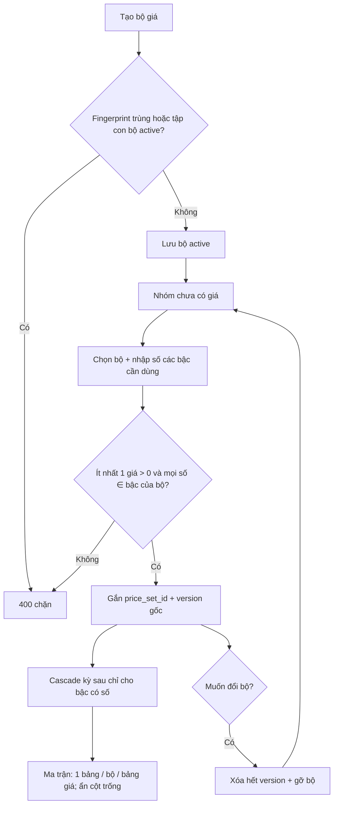

# BA Analysis: Bộ giá (price sets) cho giá theo tuyến

**Ngày:** 2026-09-17  
**Feature:** Route pricing — catalog bộ giá, gắn sống vào nhóm tuyến  
**Module:** Giá theo tuyến (`route_pricing`)  
**Scope:** FULL  
**Phụ thuộc:** `price_books`, nhóm tuyến, kỳ điều chỉnh, cascade %, ma trận, `by_truck` (đã có)  
**Feature gốc:** `docs/ba/20260711_route-pricing-analysis.md`  
**UI Spec:** `docs/ui/20260917_route-pricing-price-sets-ui-spec.md`  
**Nguồn:** Grill 2026-09-17 (Q1–Q11 đã chốt)

---

## 1. Mô tả yêu cầu

Khung giá đang nằm rải trên từng version của nhóm (`route_price_tiers` vừa là cấu trúc vừa là số tiền). User phải tự thêm/xóa bậc mỗi lần nhập giá, nên cùng một khung bị nhân thành 43 fingerprint.

Bộ giá là catalog khung **dùng chung**, toàn hệ thống, không thay Bảng giá (`price_books`). User tạo bộ giá trước. Khi nhập giá một nhóm tuyến, user chọn bộ đã có và chỉ nhập số cho từng bậc. Ô trống không sinh record. Nhóm thiếu bậc vẫn dùng bộ đủ, không tạo bộ tập con.

---

## 1.1 Phạm vi

**Trong scope**

- Entity `price_sets` + `price_set_tiers`
- Nhóm gắn sống một bộ giá (`route_price_configs.price_set_id`)
- Giá nhóm chỉ lưu số, trỏ bậc của bộ
- CRUD bộ giá (đổi tên, thêm bậc, soft-deactive khi không ai dùng)
- Chặn sửa cấu trúc / xóa khi đang có nhóm gắn
- Chặn tạo bộ trùng hoặc là tập con của bộ active
- Form Quản lý giá: chọn bộ, nhập giá, không tự thêm bậc
- Xóa hết giá của nhóm để được gắn bộ khác
- Ma trận: một bảng cho một bộ trong bảng giá đang xem; ẩn cột không nhóm nào có số
- Migration 055 chỉ tạo schema. Catalog bắt đầu rỗng; user tạo bộ trên UI. Không seed, không map giá cũ. `route_price_tiers` còn dòng thì migration fail, không xóa dữ liệu.

**Ngoài scope**

- Role / permission mới (dùng `route_pricing.view` / `route_pricing.manage`)
- Đổi luật kỳ điều chỉnh global
- Bật lại lookup (`GET /route-pricing/lookup` vẫn `LOOKUP_DEFERRED`)
- Delivery Import / hardcode khung giá trong `processDeliveryData.ts`
- Sửa seed F-sheet trong CR này (script seed sau phải chọn bộ đã có; không tự tạo bộ tập con)
- Mobile
- Đổi rule match `(from, to]` của bậc tấn / chuỗi chuyến — chỉ đổi nơi đọc cấu trúc

---

## 1.2 Giả định đã chốt

| # | Quyết định |
|---|------------|
| A1 | Bộ giá ≠ Bảng giá. Bảng giá vẫn scope tuyến và nhóm. Bộ giá là catalog global. |
| A2 | Bộ giá không chứa số tiền. Một bộ = tên + đúng một `pricing_mode` + danh sách bậc + cờ pallet. |
| A3 | Pallet là slot của bộ (`has_pallet`), không phải dòng `price_set_tiers`. Nhóm được bỏ trống. Số tiền pallet vẫn trên version, `NULL` = không có. |
| A4 | Gắn sống. `route_price_configs.price_set_id`. Mọi kỳ của nhóm dùng cùng bộ. |
| A5 | Không đổi bộ khi đã có version giá. Muốn đổi: xóa hết version, gỡ bộ, giữ nhóm, nhập lại. |
| A6 | Ô trống = không record. Cấm giá `0` và giá âm. Phải còn ít nhất một bậc có giá dương (hoặc pallet dương nếu bộ có pallet và đó là ô duy nhất). |
| A7 | Form nhập giá hiện đủ bậc của bộ. Tab ma trận chỉ hiện cột có ít nhất một nhóm **trong bảng giá đang xem** có số. |
| A8 | Đổi tên bộ luôn được. Thêm bậc được khi bộ đang được dùng; không tự sinh giá. Sửa khoảng / đơn vị / nhãn / min / thứ tự, xóa bậc, xóa bộ: chỉ khi chưa có nhóm active gắn. |
| A9 | Bộ active không được trùng fingerprint, và không được là tập con của bộ active khác (cùng mode; pallet tính là một slot). |
| A10 | Soft-deactive bộ không ai dùng. Bộ đang gắn thì không deactive. |
| A11 | Sửa giá gốc mà bỏ một bậc: xóa record bậc đó rồi cascade lại mọi kỳ sau (xóa version sau và tạo lại, đúng hành vi `updateAbsolutePrice` hiện tại). Kỳ lẻ không được xóa bậc đã có record. |
| A11b | Sửa giá một kỳ được thêm giá cho bậc thuộc bộ nhưng kỳ đó chưa có record, và thêm pallet nếu bộ có slot mà kỳ đó chưa có pallet. Giá mới bắt đầu từ kỳ đang sửa; các kỳ sau được scale theo % (làm tròn nghìn), kỳ trước giữ trống. Bộ không có pallet thì không thêm pallet. |
| A12 | Điền bậc đang trống trên giá gốc = sửa giá gốc, cascade % các kỳ sau. Không phải đổi bộ. |
| A13 | Lookup (khi được làm lại sau) chỉ khớp bậc có record giá. CR này không implement lookup. |
| A14 | ≤2,5 tấn trong bộ tấn chuẩn là đơn vị **chuyến**, range `0–2,5`, đúng data hiện tại. Min 5 tấn thuộc bậc `>2,5–8` của bộ, nhóm không ghi đè. |
| A15 | Không seed catalog trong migration. Tên unique `lower(trim(name))` khi active. |

---

## 1.3 Flowchart TO-BE



---

## 2. Data model

```text
price_sets (
  id            SERIAL PK,
  name          VARCHAR(255) NOT NULL,
  pricing_mode  VARCHAR(20) NOT NULL CHECK (by_weight | by_trips | by_truck),
  has_pallet    BOOLEAN NOT NULL DEFAULT FALSE,
  fingerprint   TEXT NOT NULL,              -- khung đã chuẩn hóa; unique khi active
  status        VARCHAR(20) NOT NULL DEFAULT 'active' CHECK (active | deactive),
  created_by, updated_by, created_at, updated_at
)
UNIQUE (lower(trim(name))) WHERE status = 'active'
UNIQUE (fingerprint) WHERE status = 'active'

price_set_tiers (
  id                SERIAL PK,
  price_set_id      INTEGER NOT NULL FK → price_sets(id),
  sort_order        INTEGER NOT NULL,
  range_from        NUMERIC(10,3),          -- NULL nếu by_truck
  range_to          NUMERIC(10,3),          -- NULL = không trần
  pricing_unit      VARCHAR(10) NOT NULL CHECK (chuyen | tan),
  min_billable_ton  NUMERIC(10,3),          -- chỉ by_weight + tan
  label             VARCHAR(255),           -- bắt buộc và unique trong bộ nếu by_truck
  UNIQUE (price_set_id, sort_order)
)

route_price_configs.price_set_id  INTEGER NULL FK → price_sets(id)
  -- NULL khi nhóm chưa có giá hoặc đã xóa giá
  -- NOT NULL khi còn ít nhất một version

route_price_tiers.price_set_tier_id  INTEGER NOT NULL FK → price_set_tiers(id)
  -- Giữ price, is_manual_adjusted, sort_order
  -- Bỏ vai trò nguồn sự thật của range/label/unit/min: đọc từ price_set_tiers
  -- Có thể giữ cột cũ nullable để migration idempotent, nhưng API không nhận range từ client nữa

route_price_versions.pallet_trip_price  NUMERIC(15,0) NULL
  -- NULL = nhóm không có pallet
  -- Cấm 0
```

**Fingerprint lưu DB** (unique khi active), không phải token dùng để so tập con:

- Dạng: `{mode}|pallet:{0|1}|{token}|{token}…`
- Bậc có nhãn: `t:{label}:{unit}`
- `by_weight`: `w:{from}-{to|inf}:{unit}[:minN]`
- `by_trips`: `trips:{from}-{to|inf}`
- Ví dụ: `by_weight|pallet:1|w:0-2.5:chuyen|w:2.5-8:tan:min5`

**Token tập con** (`priceSetTokens`), cùng mode ở tầng service khi tạo/sửa:

- Bậc có nhãn: `truck:{label}|{unit}`
- Bậc khoảng: `{unit}:{from}-{to|inf}[:minN]`
- Thêm token `pallet` nếu `has_pallet`

Tập con = mọi token của A có trong B (đếm multiplicity), và không cần A ngắn hơn — bằng nhau cũng conflict. Cả hai chiều đều chặn.

---

## 3. Không seed, không map dữ liệu cũ

Migration 055 không insert bộ giá và không gắn `price_set_id` / `price_set_tier_id` cho giá đã có. Staging và prod chưa có dữ liệu giá. Nếu `route_price_tiers` còn dòng chưa có `price_set_tier_id`, migration fail và không xóa dòng đó. Bộ giá do user tạo trên UI.

---

## 4. Business rules

- **BR-PS-001:** Mọi list/create bộ giá dùng catalog global. Không scope theo `price_book_id`.
- **BR-PS-002:** Tên trim, không rỗng, unique active không phân biệt hoa thường.
- **BR-PS-003:** Tạo bộ phải có ≥ 1 bậc. `by_truck`: nhãn trim, unique trong bộ. `by_weight` / `by_trips`: `range_from` ≥ 0, `range_from` ≤ `range_to` nếu có trần, không chồng khoảng. Hở chuỗi trips **không** bị `INVALID_TIERS` lúc tạo bộ (không rechain như form giá cũ). `min_billable_ton` chỉ bậc tấn của `by_weight`.
- **BR-PS-004:** Cấm bộ active mới nếu fingerprint trùng hoặc là tập con của bộ active khác. Cũng cấm thêm bậc làm một bộ active khác trở thành tập con.
- **BR-PS-005:** Bộ có nhóm active (`price_set_id` + config còn version): chỉ đổi tên và thêm bậc (append). Không sửa bậc đã có, không xóa, không deactive.
- **BR-PS-006:** Bộ không nhóm nào gắn: sửa cấu trúc (thay cả danh sách bậc) hoặc soft-deactive.
- **BR-PS-007:** Tạo giá gốc bắt buộc `price_set_id` của bộ active. Mode lấy từ bộ, client không gửi mode khác. Mỗi ô giá phải trỏ `price_set_tier_id` thuộc bộ đó. Không nhận range/label từ client.
- **BR-PS-008:** Giá đã lưu phải `> 0`. Ô không gửi = không insert. Pallet chỉ gửi khi `has_pallet`; không gửi = `NULL`. Cấm pallet khi bộ không có slot.
- **BR-PS-009:** Ít nhất một trong: một bậc có giá, hoặc pallet `> 0`.
- **BR-PS-010:** Đã có version thì không nhận `price_set_id` khác. Muốn đổi: `DELETE` giá nhóm (xóa mọi version của config, `price_set_id = NULL`). Nhóm tuyến, thành viên, note không đụng.
- **BR-PS-011:** Cascade và sửa giá gốc chỉ scale / tạo lại các bậc còn record. Bậc trống không được bịa số.
- **BR-PS-012:** Điều chỉnh giá trên một kỳ sửa số của bậc đã có record, được thêm giá (`> 0`) cho bậc thuộc bộ nhưng kỳ đó chưa có record (`added_tiers`), và được thêm pallet `> 0` nếu bộ `has_pallet` mà kỳ đó chưa có pallet. Không xóa bậc hoặc pallet đã có ở kỳ lẻ (muốn bỏ: sửa giá gốc, để trống). Giá thêm chỉ có từ kỳ đang sửa trở đi: kỳ này cờ chỉnh tay `true`, các kỳ sau scale `roundToThousands(prev×(1+%/100))` với cờ `false`. Kỳ trước không được bịa số. Bộ không có pallet thì `PALLET_NOT_IN_SET`.
- **BR-PS-013:** Ma trận theo `price_book_id`. Mỗi bộ có ≥ 1 nhóm trong book = một bảng. Cột = bậc (và pallet nếu có) mà **ít nhất một nhóm trong book** có giá ở bất kỳ kỳ nào. Ô nhóm không có record = trống, không hiện `0`.
- **BR-PS-014:** Trips dùng cùng hình bảng (một dòng một nhóm), không còn một dòng một bậc.
- **BR-PS-015:** Không hardcode tên bộ trong UI. Form chọn từ API. Không seed catalog trong migration.

---

## 5. Use cases

### UC-01 Tạo bộ giá

- **Actor:** user có `route_pricing.manage`
- **Pre:** tên chưa trùng active; fingerprint không trùng / không tập con
- **Post:** bộ `active`, hiện trong select nhập giá

### UC-02 Đổi tên / thêm bậc

- **Actor:** manage
- **Post:** nhóm đang gắn thấy tên mới. Bậc mới hiện trên form giá, ma trận chưa có cột cho đến khi có nhóm nhập số.

### UC-03 Nhập giá gốc theo bộ

- **Actor:** manage
- **Pre:** nhóm chưa có version; đã chọn bộ
- **Post:** config gắn bộ; version gốc + cascade chỉ các bậc đã nhập

### UC-04 Sửa số / bỏ bậc trên giá gốc

- **Actor:** manage
- **Post:** kỳ sau bị tạo lại từ gốc mới. Chỉnh tay trên kỳ sau mất (hành vi hiện tại).

### UC-05 Xóa giá để đổi bộ

- **Actor:** manage, confirm
- **Post:** không còn version; `price_set_id` null; lookup (khi có) không còn giá nhóm này

### UC-06 Xem ma trận

- **Actor:** view
- **Post:** thấy bảng theo bộ, cột chỉ bậc có số trong book đang xem

### UC-08 Thêm bậc chưa áp dụng trên một kỳ

- **Actor:** manage
- **Pre:** nhóm đã gắn bộ; kỳ đang sửa thiếu một hoặc nhiều bậc của bộ
- **Post:** bậc hoặc pallet được nhập (`> 0`) có giá từ kỳ đó trở đi, scale theo % từng kỳ sau. Ô để trống vẫn không có giá. Kỳ trước không đổi. Không xóa được bậc hoặc pallet đã có trên kỳ này. Bộ không có pallet thì không thêm pallet.

### UC-07 Ngừng dùng bộ không ai gắn

- **Actor:** manage
- **Post:** `status=deactive`, biến khỏi select. Nhóm cũ không bị xóa vì rule BR-PS-005 đã chặn nếu còn gắn.

---

## 6. Acceptance criteria

- [ ] Tạo được bộ mới không tập con; tạo bộ chỉ còn một phần bậc của bộ active khác → 400.
- [ ] Migration 055 không seed bộ và không gắn giá cũ. `route_price_tiers` còn dòng thì migration fail, không xóa.
- [ ] Form giá không còn nút thêm/xóa bậc. Select bộ khóa sau khi đã lưu giá.
- [ ] Lưu giá `0` hoặc không gửi bậc nào và không pallet → 400.
- [ ] Xóa giá nhóm: version biến mất, nhóm tuyến còn, nhập lại được bộ khác.
- [ ] Sửa khoảng của bộ đang có nhóm → 400. Đổi tên → 200.
- [ ] Thêm bậc vào bộ đang dùng → form hiện bậc mới trống; ma trận chưa thêm cột.
- [ ] Ma trận một book: các nhóm tấn chuẩn chung một bảng, không còn tách fingerprint.
- [ ] Trips: một dòng một nhóm.
- [ ] Sửa một kỳ: nhập giá bậc đang trống hoặc pallet khi bộ có slot → giá mới trên kỳ đó và các kỳ sau (scale %, làm tròn nghìn). Để trống thì không thêm. Không xóa được bậc hoặc pallet đã có trên kỳ lẻ. Kỳ trước không có ô đó vẫn trống. Bộ không có pallet thì thêm pallet → 400.
- [ ] `GET /lookup` vẫn 501 `LOOKUP_DEFERRED`.
- [ ] Không thêm permission.

---

## 7. API (delta)

Envelope giữ `{ success, message, data }`. Auth: view = GET, manage = ghi.

| Method | Path | Ghi chú |
|--------|------|---------|
| GET | `/route-pricing/price-sets` | Active. Query `include=tiers`. Ẩn deactive. |
| POST | `/route-pricing/price-sets` | `{ name, pricing_mode, has_pallet, tiers[] }` |
| PUT | `/route-pricing/price-sets/:id` | `{ name }` luôn. `{ tiers, has_pallet }` chỉ khi chưa ai gắn. |
| POST | `/route-pricing/price-sets/:id/tiers` | Append một bậc khi bộ đang được dùng (hoặc chưa). |
| DELETE | `/route-pricing/price-sets/:id` | Soft-deactive. 409 nếu còn nhóm gắn. |
| POST | `/route-pricing/prices` | Body thêm `price_set_id`. Tiers `{ price_set_tier_id, price }`. Không gửi mode tự do. |
| PUT | `/route-pricing/prices/groups/:routeGroupId/absolute` | Cùng shape giá. Bỏ `price_set_id` hoặc phải khớp bộ hiện tại. |
| PUT | `/route-pricing/prices/versions/:versionId/manual-adjust` | `tiers` vẫn đủ id bậc đã có. Thêm optional `added_tiers: { price_set_tier_id, price }[]` cho bậc bộ chưa có record trên kỳ này. |
| DELETE | `/route-pricing/prices/groups/:routeGroupId` | Xóa mọi version, `price_set_id = NULL`. |
| GET | `/route-pricing/prices/matrix` | Bảng gom theo `price_set_id`. Cột đã lọc. |

Mã lỗi mới (message tiếng Việt, code ổn định):

| Code | HTTP | Khi |
|------|------|-----|
| `PRICE_SET_NAME_DUPLICATE` | 409 | Tên active trùng |
| `INVALID_PRICE_SET_NAME` | 400 | Tên trống sau trim |
| `PRICE_SET_SUBSET` | 400 | Trùng hoặc tập con |
| `PRICE_SET_IN_USE` | 409 | Sửa cấu trúc / xóa bộ đang gắn |
| `PRICE_SET_LOCKED` | 409 | Đổi bộ khi đã có giá |
| `TIER_NOT_IN_SET` | 400 | `price_set_tier_id` không thuộc bộ |
| `PRICE_NOT_POSITIVE` | 400 | Giá ≤ 0 hoặc thiếu hết bậc |
| `PALLET_NOT_IN_SET` | 400 | Gửi pallet khi bộ không có |

Migration kế tiếp sau file số cao nhất hiện có (`054_…`). Idempotent. Không drop `route_price_tiers.range_*` trong cùng migration nếu còn code đọc cột cũ — sau khi service chỉ đọc `price_set_tiers`, migration dọn cột có thể tách bước, nhưng API mới không expose cột đó.

---

## 8. Không làm

- Không gộp số tiền của nhiều nhóm
- Không cho giá 0 nghĩa là "không phục vụ" — đó là ô trống
- Không hiện cột ma trận chỉ vì book khác có giá bậc đó
- Không hồi sinh lookup trong CR này
